# Delta Share Workflow - Data Model & Relationships

## Entity Relationship Diagram

```mermaid
erDiagram
    TENANTS ||--o{ TENANT_REGIONS : "has regions"
    TENANTS ||--o{ PROJECTS : "owns"
    PROJECTS ||--o{ REQUESTS : "has"
    PROJECTS ||--o{ PROJECT_COSTS : "incurs"
    REQUESTS ||--|| SHARE_PACKS : "contains"
    SHARE_PACKS ||--o{ RECIPIENTS : "defines"
    SHARE_PACKS ||--o{ SHARES : "defines"
    SHARES ||--o{ PIPELINES : "configures"
    PIPELINES ||--o{ JOB_METRICS : "produces"
    SHARES }o--o{ RECIPIENTS : "attached to"

    TENANTS {
        uuid record_id PK
        uuid tenant_id "BK"
        varchar business_line_name "UK"
        varchar short_name "UK"
        jsonb executive_team
        jsonb configurator_ad_group
        varchar owner
        varchar contact_email
        timestamptz effective_from
        timestamptz effective_to
        boolean is_current
        int version
        varchar created_by
        varchar change_reason
    }

    TENANT_REGIONS {
        uuid record_id PK
        uuid tenant_region_id "BK"
        uuid tenant_id FK
        varchar region
        varchar workspace_url
        timestamptz effective_from
        timestamptz effective_to
        boolean is_current
        int version
        varchar created_by
        varchar change_reason
    }

    PROJECTS {
        uuid record_id PK
        uuid project_id "BK"
        varchar project_name
        uuid tenant_id FK
        jsonb approver
        jsonb configurator
        timestamptz effective_from
        timestamptz effective_to
        boolean is_current
        int version
        varchar created_by
        varchar change_reason
    }

    REQUESTS {
        uuid record_id PK
        uuid request_id "BK"
        uuid project_id FK
        uuid share_pack_id FK
        varchar requested_by
        varchar approved_by
        varchar assigned_to
        varchar service_now_ticket
        varchar ado_ticket
        text request_description
        varchar status
        varchar request_type
        varchar approver_status
        timestamptz assigned_datetime
        timestamptz approved_datetime
        timestamptz effective_from
        timestamptz effective_to
        boolean is_current
        int version
        varchar created_by
        varchar change_reason
    }

    SHARE_PACKS {
        uuid record_id PK
        uuid share_pack_id "BK"
        varchar share_pack_name
        varchar requested_by
        varchar strategy
        varchar share_pack_status
        text provisioning_status
        text error_message
        jsonb config
        varchar file_format
        varchar original_filename
        uuid tenant_id FK
        uuid project_id FK
        timestamptz effective_from
        timestamptz effective_to
        boolean is_current
        int version
        varchar created_by
        varchar change_reason
    }

    RECIPIENTS {
        uuid record_id PK
        uuid recipient_id "BK"
        uuid share_pack_id FK
        varchar recipient_name "UK"
        varchar recipient_contact_email
        varchar recipient_type
        varchar recipient_databricks_org
        varchar recipient_databricks_id
        text description
        jsonb client_ip_addresses
        int token_expiry_days
        boolean token_rotation
        timestamptz effective_from
        timestamptz effective_to
        boolean is_current
        int version
        varchar created_by
        varchar change_reason
    }

    SHARES {
        uuid record_id PK
        uuid share_id "BK"
        uuid share_pack_id FK
        varchar share_name
        jsonb share_assets
        jsonb recipients
        varchar ext_catalog_name
        varchar ext_schema_name
        varchar prefix_assetname
        jsonb share_tags
        timestamptz effective_from
        timestamptz effective_to
        boolean is_current
        int version
        varchar created_by
        varchar change_reason
    }

    PIPELINES {
        uuid record_id PK
        uuid pipeline_id "BK"
        uuid share_pack_id FK
        uuid share_id FK
        varchar pipeline_name
        varchar databricks_pipeline_id
        varchar name_prefix
        varchar asset_name
        varchar source_table
        varchar target_table
        varchar scd_type
        varchar key_columns
        varchar schedule_type
        varchar cron_expression
        varchar cron_timezone
        jsonb notification_list
        jsonb tags
        boolean serverless
        timestamptz effective_from
        timestamptz effective_to
        boolean is_current
        int version
        varchar created_by
        varchar change_reason
    }

    USERS {
        uuid record_id PK
        uuid user_id "BK"
        varchar email "UK"
        varchar display_name
        varchar job_title
        varchar department
        boolean is_active
        varchar ad_object_id
        varchar source
        timestamptz effective_from
        timestamptz effective_to
        boolean is_current
        int version
        varchar created_by
        varchar change_reason
    }

    AD_GROUPS {
        uuid record_id PK
        uuid group_id "BK"
        varchar group_name "UK"
        varchar ad_object_id
        jsonb members
        varchar source
        timestamptz effective_from
        timestamptz effective_to
        boolean is_current
        int version
        varchar created_by
        varchar change_reason
    }

    DATABRICKS_OBJECTS {
        uuid record_id PK
        uuid object_id "BK"
        varchar workspace_url
        varchar full_name "UK"
        varchar object_type
        varchar catalog_name
        varchar schema_name
        varchar table_name
        varchar owner
        timestamptz effective_from
        timestamptz effective_to
        boolean is_current
        int version
        varchar created_by
        varchar change_reason
    }

    JOB_METRICS {
        uuid metrics_id PK
        uuid pipeline_id FK
        varchar databricks_pipeline_id
        varchar pipeline_name
        timestamptz start_time
        timestamptz end_time
        float duration_seconds
        varchar status
        varchar run_id "UK"
        text error_message
        timestamptz collected_at
    }

    PROJECT_COSTS {
        uuid cost_id PK
        uuid project_id FK
        uuid tenant_id FK
        date period_start
        date period_end
        varchar period_type
        float databricks_cost
        float azure_cost
        float network_cost
        float io_cost
        float total_cost
        varchar currency
        timestamptz collected_at
    }

    SYNC_JOBS {
        uuid sync_job_id PK
        varchar sync_type
        varchar workspace_url
        varchar status "RUNNING|COMPLETED|FAILED|INTERRUPTED"
        timestamptz started_at
        timestamptz completed_at
        int records_processed
        int records_created
        int records_updated
        int records_failed
        text error_message
        jsonb details
    }

    NOTIFICATIONS {
        uuid notification_id PK
        varchar notification_type
        varchar recipient_email
        varchar subject
        text body
        varchar related_entity_type
        uuid related_entity_id
        varchar status
        timestamptz sent_at
        text error_message
        timestamptz created_at
    }

    AUDIT_TRAIL {
        uuid audit_id PK
        varchar entity_type
        uuid entity_id
        varchar action
        varchar performed_by
        jsonb old_values
        jsonb new_values
        timestamptz timestamp
    }
```



---

## Relationship Summary

### Core Hierarchy (Top-Down)

```
TENANT (Business Line)
  |
  |── 1:N ── TENANT_REGIONS (AM, EMEA → workspace URLs)
  |
  └── 1:N ── PROJECTS
                |
                |── 1:N ── REQUESTS
                |             |
                |             └── 1:1 ── SHARE_PACKS (the config bundle)
                |                           |
                |                           |── 1:N ── RECIPIENTS
                |                           |
                |                           |── 1:N ── SHARES
                |                           |             |
                |                           |             |── N:M ── RECIPIENTS (via JSONB)
                |                           |             |
                |                           |             └── 1:N ── PIPELINES
                |                           |                           |
                |                           |                           └── 1:N ── JOB_METRICS
                |                           |
                |                           └── (config JSONB stores full YAML snapshot)
                |
                └── 1:N ── PROJECT_COSTS
```

### Sync & Reference Tables (Independent)

```
USERS ──────────── synced from Azure AD every 2 hours (SCD2)
AD_GROUPS ──────── synced from Azure AD every 2 hours (SCD2)
DATABRICKS_OBJECTS  synced from workspaces every 4 hours (SCD2)
```

### Event/Audit Tables (Append-Only)

```
SYNC_JOBS ──────── one row per sync execution (AD, Databricks, Metrics, Costs). Status: RUNNING → COMPLETED/FAILED/INTERRUPTED
NOTIFICATIONS ──── outbound emails for failures/successes
AUDIT_TRAIL ────── every create/update/delete on any entity
```

---

## Relationship Details

| Parent | Child | Cardinality | FK Column | Notes |
|--------|-------|-------------|-----------|-------|
| `tenants` | `tenant_regions` | 1:N | `tenant_id` | Each tenant has 1+ regions (AM, EMEA) |
| `tenants` | `projects` | 1:N | `tenant_id` | Business line owns multiple projects |
| `projects` | `requests` | 1:N | `project_id` | Each project can have multiple requests |
| `requests` | `share_packs` | 1:1 | `share_pack_id` | Each request has exactly one share pack |
| `share_packs` | `recipients` | 1:N | `share_pack_id` | Share pack defines recipients to create |
| `share_packs` | `shares` | 1:N | `share_pack_id` | Share pack defines shares to create |
| `shares` | `pipelines` | 1:N | `share_id` | Each share has its own pipeline config |
| `share_packs` | `pipelines` | 1:N | `share_pack_id` | Pipelines also link back to share pack |
| `shares` | `recipients` | N:M | `shares.recipients` (JSONB) | Recipient names stored in share's JSONB array |
| `pipelines` | `job_metrics` | 1:N | `pipeline_id` / `databricks_pipeline_id` | Metrics collected per pipeline |
| `projects` | `project_costs` | 1:N | `project_id` | Cost aggregated per project per period |
| `tenants` | `share_packs` | 1:N | `tenant_id` | Share packs belong to a tenant |
| `projects` | `share_packs` | 1:N | `project_id` | Share packs belong to a project |

---

## SCD Type 2 Columns (on all mutable tables)

Every table marked **SCD2** has these columns for historical tracking:

| Column | Type | Purpose |
|--------|------|---------|
| `record_id` | UUID PK | Surrogate key — unique per row (each version is a new row) |
| `<entity>_id` | UUID | Business key — stable across all versions of the same entity |
| `effective_from` | TIMESTAMPTZ | When this version became active |
| `effective_to` | TIMESTAMPTZ | When this version was superseded (`'infinity'` = current) |
| `is_current` | BOOLEAN | `true` for the latest version (fast queries) |
| `version` | INT | Sequential version number (1, 2, 3...) |
| `created_by` | VARCHAR | Who/what created this version (email, system, ad_sync, etc.) |
| `change_reason` | VARCHAR | Why this version was created (human-readable) |

### Tables with SCD2 (11 mutable tables)

| # | Table | Business Key | Never Overwritten |
|---|-------|-------------|-------------------|
| 1 | `tenants` | `tenant_id` | Name, executive team, configurator group changes tracked |
| 2 | `tenant_regions` | `tenant_region_id` | Workspace URL changes tracked |
| 3 | `projects` | `project_id` | Approver, configurator changes tracked |
| 4 | `users` | `user_id` | AD sync detects title, department, active status changes |
| 5 | `ad_groups` | `group_id` | AD sync detects member changes |
| 6 | `databricks_objects` | `object_id` | Object added/removed/owner changed |
| 7 | `share_packs` | `share_pack_id` | Status transitions: IN_PROGRESS → COMPLETED/FAILED |
| 8 | `requests` | `request_id` | Status transitions: IN_PROGRESS → APPROVED → etc. |
| 9 | `recipients` | `recipient_id` | IP list changes, token rotation, Databricks ID assigned |
| 10 | `shares` | `share_id` | Assets added/removed, recipients changed |
| 11 | `pipelines` | `pipeline_id` | Schedule changed, SCD type changed, Databricks ID assigned |

### Tables without SCD2 (5 append-only tables)

| # | Table | Why Append-Only |
|---|-------|----------------|
| 1 | `job_metrics` | Each pipeline run is a unique event — never modified |
| 2 | `project_costs` | Each cost snapshot is a point-in-time record |
| 3 | `sync_jobs` | Each sync execution is a unique event |
| 4 | `notifications` | Each notification is a unique event (status updated in place: PENDING → SENT) |
| 5 | `audit_trail` | Immutable log of every action on every entity |

---

## Data Flow Diagram

```
                    ┌─────────────────────────────────────┐
                    │     Configurator uploads YAML/XLSX   │
                    └──────────────┬──────────────────────┘
                                   │
                                   ▼
                    ┌──────────────────────────────────────┐
                    │  POST /workflow/sharepack/upload      │
                    │  1. Parse file → SharePackConfig      │
                    │  2. Validate (AD, Databricks, rules)  │
                    │  3. Store in DB (share_packs table)   │
                    │  4. Create request record             │
                    │  5. Enqueue to Azure Storage Queue    │
                    │  6. Return 202 Accepted               │
                    └──────────────┬──────────────────────┘
                                   │
                                   ▼
                    ┌──────────────────────────────────────┐
                    │     Azure Storage Queue               │
                    │     (sharepack-processing)            │
                    └──────────────┬──────────────────────┘
                                   │
                                   ▼
                    ┌──────────────────────────────────────┐
                    │     Queue Consumer (background task)  │
                    │     Dequeues → calls Orchestrator     │
                    └──────────────┬──────────────────────┘
                                   │
                    ┌──────────────┴──────────────┐
                    │                             │
                    ▼                             ▼
        ┌───────────────────┐       ┌───────────────────────┐
        │   NEW Strategy     │       │   UPDATE Strategy      │
        │                   │       │                       │
        │ 1. Create Tenant  │       │ 1. Load current state │
        │ 2. Create Project │       │ 2. Diff recipients    │
        │ 3. Create Recipients      │ 3. Diff shares        │
        │ 4. Create Shares  │       │ 4. Diff pipelines     │
        │ 5. Add Data Objects       │ 5. Execute delta only │
        │ 6. Attach Recipients      │ 6. SCD2 version all   │
        │ 7. Create Pipelines       │    changed entities   │
        │ 8. Schedule Pipelines     │                       │
        └───────────┬───────┘       └───────────┬───────────┘
                    │                             │
                    └──────────────┬──────────────┘
                                   │
                    ┌──────────────┴──────────────┐
                    │  At each step:               │
                    │  • SCD2 update status         │
                    │  • Write audit trail          │
                    │  • On failure: notify + stop  │
                    │  • On success: COMPLETED      │
                    └──────────────────────────────┘


        ┌──────────────────────────────────────────────────────────────┐
        │     Sync Worker (SEPARATE PROCESS from Web App)               │
        │                                                              │
        │  Consumes from Azure Storage Queue ("sync-triggers")         │
        │  Self-rescheduling: after each sync, enqueues next message   │
        │  with visibility_timeout = interval (delayed delivery)       │
        │                                                              │
        │  ┌──────────────────────────────────────────────┐            │
        │  │  Queue Message: {"sync_type": "AD_USERS"}    │            │
        │  │  becomes visible → worker picks it up →      │            │
        │  │  execute sync → delete msg → enqueue next    │            │
        │  │  (visible in 2h)                             │            │
        │  └──────────────────────────────────────────────┘            │
        │                                                              │
        │  Intervals:                                                  │
        │    Every 2h:  AD Users + AD Groups sync (SCD2)               │
        │    Every 4h:  Databricks Objects sync (SCD2)                 │
        │    4x/day:    Job Metrics collection                         │
        │    4x/day:    Project Cost collection                        │
        │                                                              │
        │  On startup:                                                 │
        │    1. Recover stale RUNNING jobs → mark INTERRUPTED          │
        │    2. Seed queue if empty (first deploy)                     │
        │                                                              │
        │  On failure:                                                 │
        │    Message becomes visible again → auto-retry                │
        │    Notification sent to configurator                         │
        └──────────────────────────────────────────────────────────────┘
```
