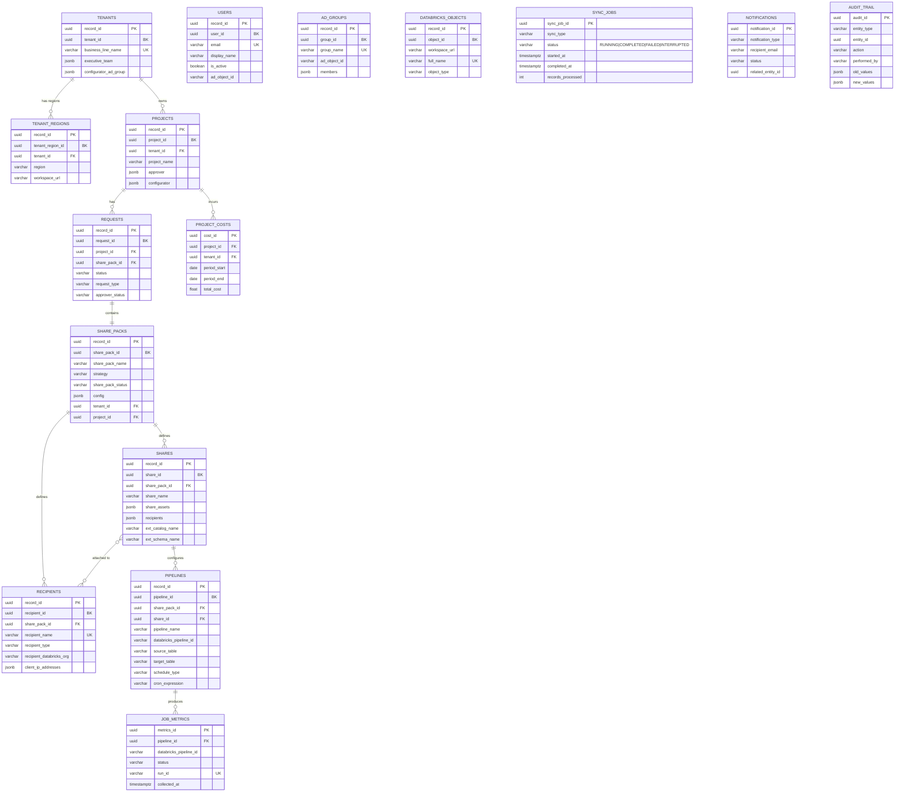

# Delta Share Workflow MVP - Implementation Plan

## Overview

Build a full workflow system for Delta Share provisioning with:
- **SCD Type 2 data model** — never overwrite, full historical traceability on every entity
- **Share Pack upload** (YAML + Excel) with async provisioning via Azure Storage Queue
- **Azure AD sync** (users + groups) and **Databricks metadata sync** on scheduled intervals
- **Metrics gathering** from Databricks and Azure **4x/day**
- **Failure tracking and notifications** to configurators/users
- Support for both **NEW** and **UPDATE** strategies in a single data model

---

## 1. Canonical Share Pack YAML Structure

Based on the actual sample file. This is the source-of-truth for the Pydantic model.

```yaml
# ── Metadata (tenant + project + request context) ──
metadata:
  version: "1.0"
  last_updated: "2025-11-20"
  owner: "Data Platform Team"
  contact_email: "data-platform@company.com"
  business_line: "Work Dynamics"                         # tenant name
  delta_share_region: "AM"                               # AM or EMEA
  configurator: "config-group@jll.com, user1@jll.com"   # AD group or comma-separated emails
  approver: "approver-group@jll.com"                     # AD group or comma-separated emails
  executive_team: "exec-group@jll.com"                   # AD group or comma-separated emails
  approver_status: "approved"                            # approved | declined | request_more_info
  requestor: "nitin.keshav@jll.com"                      # email of person submitting
  strategy: "NEW"                                        # NEW or UPDATE

# ── Recipients ──
recipient:
  - name: "Analytics Team - Internal"
    type: "D2D"                                          # D2D or D2O
    recipient: "sunil.saggar@jll.com"                    # contact email
    recipient_databricks_org: "abc-corp-datasharing-id-12345"  # Databricks org/metastore ID
    recipient_ips: []                                    # empty for D2D
    token_expiry: 30                                     # days
    token_rotation: true

  - name: "External Partner - ABC Ltd"
    type: "D2O"
    recipient: "partner@abc.com"
    recipient_databricks_org: ""                          # empty for D2O
    recipient_ips: ["10.10.221.221/24", "192.168.1.0/24"]
    token_expiry: 90
    token_rotation: false

# ── Shares (each contains assets, recipients, delta_share config, pipelines) ──
share:
  - name: "Sales Metrics Share"
    share_assets:                                        # flexible: catalog, catalog.schema, catalog.schema.table, notebooks, volumes
      - "src_catalog.src_schema.sales_transactions"
      - "src_catalog.src_schema.customer_segments_vw"
      - "notebook.ipynb"
      - "volumes/sales_data_lake"
      - "src_catalog"                                    # entire catalog
      - "src_catalog.src_schema"                         # entire schema
    recipients:
      - "Sales Organization - Internal"
      - "External Partner - ABC Ltd"
    delta_share:                                         # target workspace config for pipelines
      ext_catalog_name: "finance_analytics_catalog"
      ext_schema_name: "shared_data_schema"
      prefix_assetname: "ext"                            # prefix for target table names
      tags:
        - "jllamazonclient"
        - "shared"
    pipelines:                                           # pipelines are PER SHARE
      - name_prefix: "sales_metrics"                     # pipeline name = {prefix}_{asset_name}
        schedule:                                        # PER ASSET schedule
          sales_transactions:
            cron: "0 2 * * *"
            timezone: "UTC"
          customer_segments: "continuous"                 # string "continuous" = streaming
        notification:
          - "team@jll.com"
          - "alerts-ad-group"
        tags:
          env: "prod"
          team: "data-engineering"
        serverless: true                                 # default false
        scd_type: "2"                                    # "1", "2", or "full_refresh"
        key_columns: "id,date"                           # for SCD type 2
```

### Key structural observations:
- **Pipelines are nested inside shares**, not standalone. Each share can define its own pipeline config.
- **Schedule is per-asset** within a pipeline block. Different assets get different cron expressions or "continuous".
- **delta_share** block defines the **target** catalog/schema/prefix in the recipient's workspace.
- **share_assets** is flexible: supports `catalog`, `catalog.schema`, `catalog.schema.table`, notebooks, volumes.
- **strategy** at metadata level (NEW/UPDATE) applies to the entire share pack.
- I added `serverless`, `scd_type`, `key_columns` to pipelines — these map to existing `create_pipeline()` API params.

---

## 2. SCD Type 2 Data Model Design

### SCD2 Column Pattern (on every mutable table)

```sql
record_id         UUID PRIMARY KEY DEFAULT gen_random_uuid(),  -- surrogate key per row
<entity>_id       UUID NOT NULL,                               -- business key (stable across versions)
...entity fields...
effective_from    TIMESTAMPTZ NOT NULL DEFAULT NOW(),
effective_to      TIMESTAMPTZ NOT NULL DEFAULT 'infinity',     -- 'infinity' means current
is_current        BOOLEAN NOT NULL DEFAULT true,
version           INT NOT NULL DEFAULT 1,
created_by        VARCHAR(255) NOT NULL,
change_reason     VARCHAR(500) DEFAULT ''
```

**Query patterns:**
- Current state: `WHERE is_current = true`
- Point-in-time: `WHERE effective_from <= $ts AND effective_to > $ts`
- Full history: `WHERE entity_id = $id ORDER BY version`

### SCD2 Expire-and-Insert (repository layer)

```python
async def update_entity_scd2(pool, entity_id, new_fields, changed_by, reason):
    async with pool.acquire() as conn:
        async with conn.transaction():
            # 1. Expire current row
            old = await conn.fetchrow(
                "UPDATE deltashare.<table> SET effective_to=NOW(), is_current=false "
                "WHERE <entity>_id=$1 AND is_current=true RETURNING version", entity_id)
            # 2. Insert new version
            new_version = (old["version"] + 1) if old else 1
            await conn.execute("INSERT INTO deltashare.<table> (...) VALUES (...)", ...)
```

---

## 2B. Entity Relationship Diagram



SCD2 columns (`effective_from`, `effective_to`, `is_current`, `version`, `created_by`, `change_reason`) omitted from diagram for readability — they exist on all mutable tables (see Section 2).

---

## 3. Complete Database Schema (PostgreSQL DDL)

All tables live in `deltashare` schema. SCD2 on mutable entities. Append-only for event logs.

### File: `src/dbrx_api/workflow/db/migrations.py`

```sql
CREATE SCHEMA IF NOT EXISTS deltashare;

-- ═══════════════════════════════════════════════════════════
-- SCD2 MUTABLE ENTITIES
-- ═══════════════════════════════════════════════════════════

-- 3A. TENANTS (Business Lines)
CREATE TABLE IF NOT EXISTS deltashare.tenants (
    record_id               UUID PRIMARY KEY DEFAULT gen_random_uuid(),
    tenant_id               UUID NOT NULL,
    business_line_name      VARCHAR(255) NOT NULL,
    short_name              VARCHAR(50),
    executive_team          JSONB DEFAULT '[]',       -- ["group@jll.com", "user@jll.com"]
    configurator_ad_group   JSONB DEFAULT '[]',       -- ["config-group@jll.com"]
    owner                   VARCHAR(255),
    contact_email           VARCHAR(255),
    -- SCD2
    effective_from  TIMESTAMPTZ NOT NULL DEFAULT NOW(),
    effective_to    TIMESTAMPTZ NOT NULL DEFAULT 'infinity',
    is_current      BOOLEAN NOT NULL DEFAULT true,
    version         INT NOT NULL DEFAULT 1,
    created_by      VARCHAR(255) NOT NULL,
    change_reason   VARCHAR(500) DEFAULT ''
);
CREATE INDEX IF NOT EXISTS idx_tenants_current
    ON deltashare.tenants(tenant_id) WHERE is_current = true;
CREATE INDEX IF NOT EXISTS idx_tenants_name
    ON deltashare.tenants(business_line_name) WHERE is_current = true;

-- 3B. TENANT REGIONS (maps tenant + region -> workspace URL)
CREATE TABLE IF NOT EXISTS deltashare.tenant_regions (
    record_id       UUID PRIMARY KEY DEFAULT gen_random_uuid(),
    tenant_region_id UUID NOT NULL,
    tenant_id       UUID NOT NULL,
    region          VARCHAR(10) NOT NULL,             -- AM, EMEA
    workspace_url   VARCHAR(500) NOT NULL,
    -- SCD2
    effective_from  TIMESTAMPTZ NOT NULL DEFAULT NOW(),
    effective_to    TIMESTAMPTZ NOT NULL DEFAULT 'infinity',
    is_current      BOOLEAN NOT NULL DEFAULT true,
    version         INT NOT NULL DEFAULT 1,
    created_by      VARCHAR(255) NOT NULL,
    change_reason   VARCHAR(500) DEFAULT ''
);
CREATE UNIQUE INDEX IF NOT EXISTS idx_tenant_regions_current
    ON deltashare.tenant_regions(tenant_id, region) WHERE is_current = true;

-- 3C. PROJECTS
CREATE TABLE IF NOT EXISTS deltashare.projects (
    record_id       UUID PRIMARY KEY DEFAULT gen_random_uuid(),
    project_id      UUID NOT NULL,
    project_name    VARCHAR(255) NOT NULL,
    tenant_id       UUID NOT NULL,
    approver        JSONB DEFAULT '[]',               -- ["approver@jll.com", "ad-group"]
    configurator    JSONB DEFAULT '[]',               -- ["config@jll.com"]
    -- SCD2
    effective_from  TIMESTAMPTZ NOT NULL DEFAULT NOW(),
    effective_to    TIMESTAMPTZ NOT NULL DEFAULT 'infinity',
    is_current      BOOLEAN NOT NULL DEFAULT true,
    version         INT NOT NULL DEFAULT 1,
    created_by      VARCHAR(255) NOT NULL,
    change_reason   VARCHAR(500) DEFAULT ''
);
CREATE UNIQUE INDEX IF NOT EXISTS idx_projects_current
    ON deltashare.projects(tenant_id, project_name) WHERE is_current = true;

-- 3D. USERS (synced from Azure AD)
CREATE TABLE IF NOT EXISTS deltashare.users (
    record_id       UUID PRIMARY KEY DEFAULT gen_random_uuid(),
    user_id         UUID NOT NULL,
    email           VARCHAR(255) NOT NULL,
    display_name    VARCHAR(255),
    job_title       VARCHAR(255),
    department      VARCHAR(255),
    is_active       BOOLEAN DEFAULT true,
    ad_object_id    VARCHAR(255),                     -- Azure AD object ID
    source          VARCHAR(50) DEFAULT 'azure_ad',
    -- SCD2
    effective_from  TIMESTAMPTZ NOT NULL DEFAULT NOW(),
    effective_to    TIMESTAMPTZ NOT NULL DEFAULT 'infinity',
    is_current      BOOLEAN NOT NULL DEFAULT true,
    version         INT NOT NULL DEFAULT 1,
    created_by      VARCHAR(255) NOT NULL DEFAULT 'ad_sync',
    change_reason   VARCHAR(500) DEFAULT ''
);
CREATE UNIQUE INDEX IF NOT EXISTS idx_users_email
    ON deltashare.users(email) WHERE is_current = true;

-- 3E. AD GROUPS (synced from Azure AD)
CREATE TABLE IF NOT EXISTS deltashare.ad_groups (
    record_id       UUID PRIMARY KEY DEFAULT gen_random_uuid(),
    group_id        UUID NOT NULL,
    group_name      VARCHAR(255) NOT NULL,
    ad_object_id    VARCHAR(255),
    members         JSONB DEFAULT '[]',               -- ["user1@jll.com", "user2@jll.com"]
    source          VARCHAR(50) DEFAULT 'azure_ad',
    -- SCD2
    effective_from  TIMESTAMPTZ NOT NULL DEFAULT NOW(),
    effective_to    TIMESTAMPTZ NOT NULL DEFAULT 'infinity',
    is_current      BOOLEAN NOT NULL DEFAULT true,
    version         INT NOT NULL DEFAULT 1,
    created_by      VARCHAR(255) NOT NULL DEFAULT 'ad_sync',
    change_reason   VARCHAR(500) DEFAULT ''
);
CREATE UNIQUE INDEX IF NOT EXISTS idx_ad_groups_name
    ON deltashare.ad_groups(group_name) WHERE is_current = true;

-- 3F. DATABRICKS OBJECTS (synced from Databricks workspaces)
CREATE TABLE IF NOT EXISTS deltashare.databricks_objects (
    record_id           UUID PRIMARY KEY DEFAULT gen_random_uuid(),
    object_id           UUID NOT NULL,
    workspace_url       VARCHAR(500) NOT NULL,
    full_name           VARCHAR(500) NOT NULL,         -- catalog.schema.table or catalog.schema
    object_type         VARCHAR(50) NOT NULL,          -- TABLE, VIEW, SCHEMA, CATALOG, NOTEBOOK, VOLUME
    catalog_name        VARCHAR(255),
    schema_name         VARCHAR(255),
    table_name          VARCHAR(255),
    owner               VARCHAR(255),
    -- SCD2
    effective_from  TIMESTAMPTZ NOT NULL DEFAULT NOW(),
    effective_to    TIMESTAMPTZ NOT NULL DEFAULT 'infinity',
    is_current      BOOLEAN NOT NULL DEFAULT true,
    version         INT NOT NULL DEFAULT 1,
    created_by      VARCHAR(255) NOT NULL DEFAULT 'dbrx_sync',
    change_reason   VARCHAR(500) DEFAULT ''
);
CREATE UNIQUE INDEX IF NOT EXISTS idx_dbrx_objects_current
    ON deltashare.databricks_objects(workspace_url, full_name) WHERE is_current = true;

-- 3G. SHARE PACKS (the config bundle — SCD2 for status transitions)
CREATE TABLE IF NOT EXISTS deltashare.share_packs (
    record_id               UUID PRIMARY KEY DEFAULT gen_random_uuid(),
    share_pack_id           UUID NOT NULL,
    share_pack_name         VARCHAR(255) NOT NULL,
    requested_by            VARCHAR(255) NOT NULL,
    strategy                VARCHAR(20) NOT NULL DEFAULT 'NEW',  -- NEW or UPDATE
    share_pack_status       VARCHAR(30) NOT NULL DEFAULT 'IN_PROGRESS',
    provisioning_status     TEXT DEFAULT '',
    error_message           TEXT DEFAULT '',
    config                  JSONB NOT NULL,            -- full YAML/Excel content as JSON
    file_format             VARCHAR(10) DEFAULT 'yaml', -- yaml or xlsx
    original_filename       VARCHAR(500),
    tenant_id               UUID,
    project_id              UUID,
    -- SCD2
    effective_from  TIMESTAMPTZ NOT NULL DEFAULT NOW(),
    effective_to    TIMESTAMPTZ NOT NULL DEFAULT 'infinity',
    is_current      BOOLEAN NOT NULL DEFAULT true,
    version         INT NOT NULL DEFAULT 1,
    created_by      VARCHAR(255) NOT NULL,
    change_reason   VARCHAR(500) DEFAULT ''
);
CREATE INDEX IF NOT EXISTS idx_share_packs_current
    ON deltashare.share_packs(share_pack_id) WHERE is_current = true;
CREATE INDEX IF NOT EXISTS idx_share_packs_status
    ON deltashare.share_packs(share_pack_status) WHERE is_current = true;
CREATE INDEX IF NOT EXISTS idx_share_packs_tenant
    ON deltashare.share_packs(tenant_id) WHERE is_current = true;

-- 3H. REQUESTS (tracks approval workflow — SCD2 for status transitions)
CREATE TABLE IF NOT EXISTS deltashare.requests (
    record_id               UUID PRIMARY KEY DEFAULT gen_random_uuid(),
    request_id              UUID NOT NULL,
    project_id              UUID NOT NULL,
    share_pack_id           UUID NOT NULL,
    requested_by            VARCHAR(255) NOT NULL,
    approved_by             VARCHAR(255),
    assigned_to             VARCHAR(255),
    service_now_ticket      VARCHAR(100),
    ado_ticket              VARCHAR(100),
    request_description     TEXT NOT NULL,
    status                  VARCHAR(30) NOT NULL DEFAULT 'IN_PROGRESS',
    request_type            VARCHAR(20) NOT NULL DEFAULT 'NEW',
    approver_status         VARCHAR(30) DEFAULT 'approved', -- approved|declined|request_more_info
    assigned_datetime       TIMESTAMPTZ,
    approved_datetime       TIMESTAMPTZ,
    -- SCD2
    effective_from  TIMESTAMPTZ NOT NULL DEFAULT NOW(),
    effective_to    TIMESTAMPTZ NOT NULL DEFAULT 'infinity',
    is_current      BOOLEAN NOT NULL DEFAULT true,
    version         INT NOT NULL DEFAULT 1,
    created_by      VARCHAR(255) NOT NULL,
    change_reason   VARCHAR(500) DEFAULT ''
);
CREATE INDEX IF NOT EXISTS idx_requests_current
    ON deltashare.requests(request_id) WHERE is_current = true;
CREATE INDEX IF NOT EXISTS idx_requests_project
    ON deltashare.requests(project_id) WHERE is_current = true;

-- 3I. RECIPIENTS (provisioned recipients — SCD2)
CREATE TABLE IF NOT EXISTS deltashare.recipients (
    record_id               UUID PRIMARY KEY DEFAULT gen_random_uuid(),
    recipient_id            UUID NOT NULL,
    share_pack_id           UUID NOT NULL,
    recipient_name          VARCHAR(255) NOT NULL,
    recipient_contact_email VARCHAR(255),              -- contact person email
    recipient_type          VARCHAR(10) NOT NULL,      -- D2D or D2O
    recipient_databricks_org VARCHAR(500),             -- Databricks org/metastore ID
    recipient_databricks_id  VARCHAR(255),             -- set after provisioning
    description             TEXT,
    client_ip_addresses     JSONB DEFAULT '[]',
    token_expiry_days       INT,
    token_rotation          BOOLEAN DEFAULT false,
    -- SCD2
    effective_from  TIMESTAMPTZ NOT NULL DEFAULT NOW(),
    effective_to    TIMESTAMPTZ NOT NULL DEFAULT 'infinity',
    is_current      BOOLEAN NOT NULL DEFAULT true,
    version         INT NOT NULL DEFAULT 1,
    created_by      VARCHAR(255) NOT NULL,
    change_reason   VARCHAR(500) DEFAULT ''
);
CREATE INDEX IF NOT EXISTS idx_recipients_current
    ON deltashare.recipients(recipient_id) WHERE is_current = true;
CREATE UNIQUE INDEX IF NOT EXISTS idx_recipients_name
    ON deltashare.recipients(recipient_name) WHERE is_current = true;

-- 3J. SHARES (provisioned shares — SCD2)
CREATE TABLE IF NOT EXISTS deltashare.shares (
    record_id           UUID PRIMARY KEY DEFAULT gen_random_uuid(),
    share_id            UUID NOT NULL,
    share_pack_id       UUID NOT NULL,
    share_name          VARCHAR(255) NOT NULL,
    share_assets        JSONB NOT NULL DEFAULT '[]',   -- list of asset strings from YAML
    recipients          JSONB NOT NULL DEFAULT '[]',   -- list of recipient names
    -- delta_share target config
    ext_catalog_name    VARCHAR(255),
    ext_schema_name     VARCHAR(255),
    prefix_assetname    VARCHAR(100),
    share_tags          JSONB DEFAULT '[]',
    -- SCD2
    effective_from  TIMESTAMPTZ NOT NULL DEFAULT NOW(),
    effective_to    TIMESTAMPTZ NOT NULL DEFAULT 'infinity',
    is_current      BOOLEAN NOT NULL DEFAULT true,
    version         INT NOT NULL DEFAULT 1,
    created_by      VARCHAR(255) NOT NULL,
    change_reason   VARCHAR(500) DEFAULT ''
);
CREATE INDEX IF NOT EXISTS idx_shares_current
    ON deltashare.shares(share_id) WHERE is_current = true;

-- 3K. PIPELINES (provisioned pipelines — SCD2, one row per asset schedule)
CREATE TABLE IF NOT EXISTS deltashare.pipelines (
    record_id               UUID PRIMARY KEY DEFAULT gen_random_uuid(),
    pipeline_id             UUID NOT NULL,
    share_pack_id           UUID NOT NULL,
    share_id                UUID NOT NULL,             -- parent share
    pipeline_name           VARCHAR(255) NOT NULL,     -- {name_prefix}_{asset_name}
    databricks_pipeline_id  VARCHAR(255),              -- set after provisioning
    name_prefix             VARCHAR(255),
    asset_name              VARCHAR(500) NOT NULL,     -- source asset this pipeline syncs
    source_table            VARCHAR(500) NOT NULL,     -- fully qualified source
    target_table            VARCHAR(500) NOT NULL,     -- constructed: {ext_catalog}.{ext_schema}.{prefix}_{asset}
    scd_type                VARCHAR(20) DEFAULT '2',   -- 1, 2, or full_refresh
    key_columns             VARCHAR(500),              -- comma-separated, required for SCD2
    schedule_type           VARCHAR(20) NOT NULL,      -- CRON or CONTINUOUS
    cron_expression         VARCHAR(100),
    cron_timezone           VARCHAR(100) DEFAULT 'UTC',
    notification_list       JSONB DEFAULT '[]',
    tags                    JSONB DEFAULT '{}',
    serverless              BOOLEAN DEFAULT false,
    -- SCD2
    effective_from  TIMESTAMPTZ NOT NULL DEFAULT NOW(),
    effective_to    TIMESTAMPTZ NOT NULL DEFAULT 'infinity',
    is_current      BOOLEAN NOT NULL DEFAULT true,
    version         INT NOT NULL DEFAULT 1,
    created_by      VARCHAR(255) NOT NULL,
    change_reason   VARCHAR(500) DEFAULT ''
);
CREATE INDEX IF NOT EXISTS idx_pipelines_current
    ON deltashare.pipelines(pipeline_id) WHERE is_current = true;
CREATE INDEX IF NOT EXISTS idx_pipelines_share
    ON deltashare.pipelines(share_id) WHERE is_current = true;

-- ═══════════════════════════════════════════════════════════
-- APPEND-ONLY TABLES (immutable event logs)
-- ═══════════════════════════════════════════════════════════

-- 3L. JOB METRICS
CREATE TABLE IF NOT EXISTS deltashare.job_metrics (
    metrics_id          UUID PRIMARY KEY DEFAULT gen_random_uuid(),
    pipeline_id         UUID,                          -- FK to deltashare.pipelines.pipeline_id
    databricks_pipeline_id VARCHAR(255) NOT NULL,
    pipeline_name       VARCHAR(255) NOT NULL,
    start_time          TIMESTAMPTZ,
    end_time            TIMESTAMPTZ,
    duration_seconds    DOUBLE PRECISION,
    status              VARCHAR(50) NOT NULL,
    run_id              VARCHAR(255),
    error_message       TEXT,
    collected_at        TIMESTAMPTZ NOT NULL DEFAULT NOW()
);
CREATE INDEX IF NOT EXISTS idx_metrics_pipeline ON deltashare.job_metrics(databricks_pipeline_id);
CREATE INDEX IF NOT EXISTS idx_metrics_time ON deltashare.job_metrics(collected_at DESC);
CREATE UNIQUE INDEX IF NOT EXISTS idx_metrics_run_id ON deltashare.job_metrics(run_id);

-- 3M. PROJECT COSTS
CREATE TABLE IF NOT EXISTS deltashare.project_costs (
    cost_id             UUID PRIMARY KEY DEFAULT gen_random_uuid(),
    project_id          UUID NOT NULL,
    tenant_id           UUID NOT NULL,
    period_start        DATE NOT NULL,
    period_end          DATE NOT NULL,
    period_type         VARCHAR(20) NOT NULL DEFAULT 'weekly',  -- weekly or monthly
    databricks_cost     DOUBLE PRECISION DEFAULT 0,
    azure_cost          DOUBLE PRECISION DEFAULT 0,
    network_cost        DOUBLE PRECISION DEFAULT 0,
    io_cost             DOUBLE PRECISION DEFAULT 0,
    total_cost          DOUBLE PRECISION GENERATED ALWAYS AS
                        (databricks_cost + azure_cost + network_cost + io_cost) STORED,
    currency            VARCHAR(10) DEFAULT 'USD',
    collected_at        TIMESTAMPTZ NOT NULL DEFAULT NOW()
);
CREATE INDEX IF NOT EXISTS idx_costs_project ON deltashare.project_costs(project_id);
CREATE INDEX IF NOT EXISTS idx_costs_period ON deltashare.project_costs(period_start, period_end);

-- 3N. SYNC JOBS (tracks every sync execution)
CREATE TABLE IF NOT EXISTS deltashare.sync_jobs (
    sync_job_id         UUID PRIMARY KEY DEFAULT gen_random_uuid(),
    sync_type           VARCHAR(50) NOT NULL,          -- AD_USERS, AD_GROUPS, DATABRICKS_OBJECTS, JOB_METRICS, PROJECT_COSTS
    workspace_url       VARCHAR(500),                  -- null for AD syncs
    status              VARCHAR(20) NOT NULL DEFAULT 'RUNNING',  -- RUNNING, COMPLETED, FAILED, INTERRUPTED
    started_at          TIMESTAMPTZ NOT NULL DEFAULT NOW(),
    completed_at        TIMESTAMPTZ,
    records_processed   INT DEFAULT 0,
    records_created     INT DEFAULT 0,
    records_updated     INT DEFAULT 0,
    records_failed      INT DEFAULT 0,
    error_message       TEXT DEFAULT '',
    details             JSONB DEFAULT '{}'
);
CREATE INDEX IF NOT EXISTS idx_sync_type_time ON deltashare.sync_jobs(sync_type, started_at DESC);
CREATE INDEX IF NOT EXISTS idx_sync_status ON deltashare.sync_jobs(status) WHERE status IN ('FAILED', 'INTERRUPTED');

-- 3O. NOTIFICATIONS
CREATE TABLE IF NOT EXISTS deltashare.notifications (
    notification_id     UUID PRIMARY KEY DEFAULT gen_random_uuid(),
    notification_type   VARCHAR(50) NOT NULL,          -- PROVISION_SUCCESS, PROVISION_FAILURE, SYNC_FAILURE, etc.
    recipient_email     VARCHAR(255) NOT NULL,
    subject             VARCHAR(500) NOT NULL,
    body                TEXT NOT NULL,
    related_entity_type VARCHAR(50),                   -- share_pack, sync_job, pipeline, etc.
    related_entity_id   UUID,
    status              VARCHAR(20) NOT NULL DEFAULT 'PENDING',
    sent_at             TIMESTAMPTZ,
    error_message       TEXT,
    created_at          TIMESTAMPTZ NOT NULL DEFAULT NOW()
);
CREATE INDEX IF NOT EXISTS idx_notif_status ON deltashare.notifications(status);

-- 3P. AUDIT TRAIL (every action on every entity)
CREATE TABLE IF NOT EXISTS deltashare.audit_trail (
    audit_id            UUID PRIMARY KEY DEFAULT gen_random_uuid(),
    entity_type         VARCHAR(50) NOT NULL,          -- tenant, project, share_pack, share, recipient, pipeline
    entity_id           UUID NOT NULL,
    action              VARCHAR(50) NOT NULL,          -- CREATED, UPDATED, DELETED, STATUS_CHANGED, PROVISIONED
    performed_by        VARCHAR(255) NOT NULL,
    old_values          JSONB,
    new_values          JSONB,
    timestamp           TIMESTAMPTZ NOT NULL DEFAULT NOW()
);
CREATE INDEX IF NOT EXISTS idx_audit_entity ON deltashare.audit_trail(entity_type, entity_id);
CREATE INDEX IF NOT EXISTS idx_audit_time ON deltashare.audit_trail(timestamp DESC);
```

---

## 4. Pydantic Models (matching actual YAML structure)

### File: `src/dbrx_api/workflow/models/share_pack.py`

```python
from pydantic import BaseModel, Field, field_validator, model_validator
from typing import Dict, List, Optional, Union
from dbrx_api.workflow.enums import RecipientType, ScheduleType

# ── Metadata ──
class SharePackMetadata(BaseModel):
    version: str = "1.0"
    last_updated: Optional[str] = None
    owner: Optional[str] = None
    contact_email: Optional[str] = None
    business_line: str                              # tenant name
    delta_share_region: str                         # "AM" or "EMEA"
    configurator: str                               # comma-separated emails or AD group
    approver: str                                   # comma-separated emails or AD group
    executive_team: str                             # comma-separated emails or AD group
    approver_status: str = "approved"               # approved | declined | request_more_info
    requestor: str                                  # email
    strategy: str = "NEW"                           # NEW or UPDATE

    @field_validator("delta_share_region")
    @classmethod
    def validate_region(cls, v):
        if v.upper() not in ("AM", "EMEA"):
            raise ValueError("delta_share_region must be AM or EMEA")
        return v.upper()

    @field_validator("strategy")
    @classmethod
    def validate_strategy(cls, v):
        if v.upper() not in ("NEW", "UPDATE"):
            raise ValueError("strategy must be NEW or UPDATE")
        return v.upper()

    @field_validator("approver_status")
    @classmethod
    def validate_approver_status(cls, v):
        allowed = {"approved", "declined", "request_more_info"}
        if v.lower() not in allowed:
            raise ValueError(f"approver_status must be one of {allowed}")
        return v.lower()

# ── Recipient ──
class RecipientConfig(BaseModel):
    name: str
    type: str                                       # "D2D" or "D2O"
    recipient: str                                  # contact email
    recipient_databricks_org: Optional[str] = ""    # metastore/org ID (D2D)
    recipient_ips: List[str] = Field(default_factory=list)
    token_expiry: int = 30                          # days
    token_rotation: bool = False

    @field_validator("type")
    @classmethod
    def validate_type(cls, v):
        if v.upper() not in ("D2D", "D2O"):
            raise ValueError("type must be D2D or D2O")
        return v.upper()

    @model_validator(mode="after")
    def validate_d2d_fields(self):
        if self.type == "D2D" and not self.recipient_databricks_org:
            raise ValueError("D2D recipients require recipient_databricks_org")
        return self

# ── Per-asset schedule (value is either a dict with cron/timezone OR string "continuous") ──
# In YAML:
#   sales_transactions:
#     cron: "0 2 * * *"
#     timezone: "UTC"
#   customer_segments: "continuous"

class CronSchedule(BaseModel):
    cron: str
    timezone: str = "UTC"

# schedule dict value is either CronSchedule or the string "continuous"
# Handled in parser: normalize to Dict[str, Union[CronSchedule, str]]

# ── Delta Share target config ──
class DeltaShareConfig(BaseModel):
    ext_catalog_name: str
    ext_schema_name: str
    prefix_assetname: str = ""
    tags: List[str] = Field(default_factory=list)

# ── Pipeline config (per share) ──
class PipelineConfig(BaseModel):
    name_prefix: str
    schedule: Dict[str, Union[CronSchedule, str]]   # asset_name -> cron or "continuous"
    notification: List[str] = Field(default_factory=list)
    tags: Dict[str, str] = Field(default_factory=dict)
    serverless: bool = False
    scd_type: str = "2"                             # "1", "2", or "full_refresh"
    key_columns: str = ""                           # comma-separated

    @field_validator("scd_type")
    @classmethod
    def validate_scd(cls, v):
        if v.lower() not in ("1", "2", "full_refresh"):
            raise ValueError("scd_type must be 1, 2, or full_refresh")
        return v.lower()

    @model_validator(mode="after")
    def validate_key_columns_for_scd2(self):
        if self.scd_type == "2" and not self.key_columns:
            raise ValueError("key_columns required for SCD type 2 pipelines")
        return self

# ── Share ──
class ShareConfig(BaseModel):
    name: str
    share_assets: List[str]                         # flexible: catalog, catalog.schema, catalog.schema.table, notebook, volume
    recipients: List[str]                           # references to recipient names
    delta_share: DeltaShareConfig
    pipelines: List[PipelineConfig] = Field(default_factory=list)

# ── Top-level share pack config (the full YAML) ──
class SharePackConfig(BaseModel):
    metadata: SharePackMetadata
    recipient: List[RecipientConfig]                # YAML key is "recipient" (not "recipients")
    share: List[ShareConfig]                        # YAML key is "share" (not "shares")

    @model_validator(mode="after")
    def validate_recipient_references(self):
        """All recipients referenced in shares must exist in recipient list."""
        known = {r.name for r in self.recipient}
        for s in self.share:
            for rname in s.recipients:
                if rname not in known:
                    raise ValueError(
                        f"Share '{s.name}' references unknown recipient '{rname}'. "
                        f"Known: {known}"
                    )
        return self

    @model_validator(mode="after")
    def validate_pipeline_assets(self):
        """All assets in pipeline schedules must exist in share_assets."""
        for s in self.share:
            asset_basenames = set()
            for asset in s.share_assets:
                parts = asset.split(".")
                asset_basenames.add(parts[-1] if parts else asset)
            for p in s.pipelines:
                for asset_key in p.schedule:
                    if asset_key not in asset_basenames:
                        raise ValueError(
                            f"Pipeline '{p.name_prefix}' schedule references "
                            f"'{asset_key}' not found in share '{s.name}' assets"
                        )
        return self
```

---

## 5. How UPDATE Strategy Works

When `metadata.strategy = "UPDATE"`:

1. **Parser** reads the YAML/Excel identically to NEW
2. **Validator** checks that referenced entities already exist in DB (share names, recipient names)
3. **Orchestrator** performs a **diff** between new config and current state:

| Entity | Diff Logic | Action |
|--------|-----------|--------|
| Recipients | Compare by `name` | New names → create. Changed fields → update in Databricks + SCD2 version. Missing names → no action (don't delete) |
| Shares | Compare by `name` | New → create. Changed assets → add/remove data objects. Changed recipients → add/remove permissions |
| Pipelines | Compare by `{prefix}_{asset}` | New → create + schedule. Changed schedule → update. Changed scd_type → update pipeline config |

4. Every change creates a **new SCD2 version** of the affected entity
5. **Audit trail** records old_values and new_values for every change

---

## 6. Directory Structure

```
src/dbrx_api/
  workflow/
    __init__.py
    enums.py                          # All status/type enums
    models/
      __init__.py
      share_pack.py                   # SharePackConfig + all nested models (Section 4)
      tenant.py                       # Tenant, TenantRegion DB models
      project.py                      # Project DB model
      request.py                      # Request DB model
      user.py                         # User (AD-synced) DB model
      ad_group.py                     # AD Group DB model
      databricks_object.py            # Databricks object DB model
      job_metrics.py                  # JobMetrics model
      project_cost.py                 # ProjectCost model
    db/
      __init__.py
      pool.py                         # asyncpg connection pool (reuse postgresql_handler pattern)
      migrations.py                   # All DDL from Section 3
      scd2.py                         # Generic SCD2 expire-and-insert helpers
      repository_tenant.py
      repository_project.py
      repository_request.py
      repository_share_pack.py
      repository_recipient.py
      repository_share.py
      repository_pipeline.py
      repository_user.py
      repository_ad_group.py
      repository_databricks_object.py
      repository_metrics.py
      repository_cost.py
      repository_sync_job.py
      repository_notification.py
      repository_audit.py
    parsers/
      __init__.py
      yaml_parser.py                  # YAML -> SharePackConfig
      excel_parser.py                 # Excel -> SharePackConfig (4 sheets)
      parser_factory.py               # Format detection + dispatch
    validators/
      __init__.py
      ad_validator.py                 # Verify emails/AD groups exist in Azure AD
      databricks_validator.py         # Verify objects exist in Databricks workspace
      business_validator.py           # Unique names, valid references, complete config
      validation_runner.py            # Orchestrates all validators, returns errors + warnings
    queue/
      __init__.py
      queue_client.py                 # Azure Storage Queue wrapper (send/receive/delete)
      queue_consumer.py               # Background polling loop -> calls orchestrator
    sync/
      __init__.py
      ad_sync.py                      # Graph API -> users + ad_groups (SCD2)
      databricks_sync.py              # WorkspaceClient -> databricks_objects (SCD2)
      metrics_collector.py            # Pipeline run metrics + Azure costs (append-only)
      sync_queue_client.py            # Azure Storage Queue wrapper for sync triggers
      sync_worker.py                  # Separate process: consumes sync queue, executes syncs
      notification_sender.py          # Email dispatch (SMTP/SendGrid)
    orchestrator/
      __init__.py
      provisioning.py                 # NEW strategy: create all
      update_handler.py               # UPDATE strategy: diff and apply changes
      status_tracker.py               # SCD2 status updates + audit trail writes
  routes/
    routes_workflow.py                # API endpoints
  schemas/
    schemas_workflow.py               # API response models (PascalCase)
```

---

## 7. Provisioning Orchestrator

### NEW Strategy (`workflow/orchestrator/provisioning.py`)

```
Step 1: Resolve/Create Tenant   -> Find or create tenant from metadata.business_line
Step 2: Resolve/Create Project  -> Find or create project
Step 3: Create Recipients       -> dltshr.recipient.create_recipient_d2d(
                                       recipient_name, recipient_identifier,
                                       description, workspace_url, sharing_code)
                                   dltshr.recipient.create_recipient_d2o(
                                       recipient_name, description,
                                       workspace_url, ip_access_list)
Step 4: Create Shares           -> dltshr.share.create_share(
                                       workspace_url, share_name, description)
Step 5: Add Data Objects        -> dltshr.share.add_data_object_to_share(
                                       workspace_url, share_name, objects_to_add)
Step 6: Attach Recipients       -> dltshr.share.add_recipients_to_share(
                                       workspace_url, share_name, recipient_name)
Step 7: Create Pipelines        -> For each share, for each asset in schedule:
                                   pipeline_name = f"{name_prefix}_{asset_name}"
                                   target_table = f"{ext_catalog}.{ext_schema}.{prefix}_{asset}"
                                   jobs.dbrx_pipelines.create_pipeline(
                                       workspace_url, pipeline_name,
                                       target_catalog_name, target_schema_name,
                                       configuration={
                                           "pipelines.source_table": source_asset,
                                           "pipelines.keys": key_columns,
                                           "pipelines.target_table": target_name,
                                           "pipelines.scd_type": scd_type,
                                       },
                                       notifications_list, tags, serverless)
Step 8: Schedule Pipelines      -> For CRON assets:
                                   jobs.dbrx_schedule.create_schedule_for_pipeline(
                                       workspace_url, job_name=pipeline_name,
                                       pipeline_id, cron_expression, time_zone,
                                       email_notifications=notification_list, tags)
                                   For CONTINUOUS assets:
                                   jobs.dbrx_pipelines.update_pipeline_continuous(
                                       workspace_url, pipeline_name, continuous=True)
```

At each step: update provisioning_status (SCD2), write audit trail, on failure send notification.

### UPDATE Strategy (`workflow/orchestrator/update_handler.py`)

```
Step 1: Load current state from DB (all entities WHERE share_pack.is_current AND share_pack_name matches)
Step 2: Diff recipients: new, changed, unchanged
Step 3: Diff shares: new, changed assets, changed recipients
Step 4: Diff pipelines: new, changed schedule/config
Step 5: Execute only the delta operations (add/remove/update)
Step 6: SCD2 version all changed entities
```

---

## 8. Sync System

### 8A. AD Sync (`workflow/sync/ad_sync.py`) — every 2 hours

```python
async def sync_ad_users(db_pool, graph_client_id, graph_client_secret, azure_tenant_id):
    """Graph API -> deltashare.users (SCD2)"""
    # 1. POST https://login.microsoftonline.com/{tenant}/oauth2/v2.0/token (client_credentials)
    # 2. GET https://graph.microsoft.com/v1.0/users?$select=id,mail,displayName,jobTitle,department
    # 3. Compare each user with DB (is_current=true)
    # 4. SCD2 upsert changes, expire removed users (is_active=false)
    # 5. Write sync_job row

async def sync_ad_groups(db_pool, graph_client_id, graph_client_secret, azure_tenant_id):
    """Graph API -> deltashare.ad_groups (SCD2)"""
    # 1. GET https://graph.microsoft.com/v1.0/groups?$select=id,displayName
    # 2. For each group: GET .../groups/{id}/members
    # 3. SCD2 upsert, track member changes
```

### 8B. Databricks Sync (`workflow/sync/databricks_sync.py`) — every 4 hours

```python
async def sync_databricks_objects(db_pool, workspace_urls: List[str]):
    """For each workspace: catalogs -> schemas -> tables -> deltashare.databricks_objects (SCD2)"""
    # Uses existing get_auth_token() + WorkspaceClient
    # w_client.catalogs.list(), w_client.schemas.list(), w_client.tables.list()
```

### 8C. Metrics Collector (`workflow/sync/metrics_collector.py`) — 4x/day

```python
async def collect_job_metrics(db_pool, workspace_url):
    """Reuses existing get_job_run_metrics() from metrics/pipeline_metrics.py"""
    # 1. SELECT databricks_pipeline_id FROM deltashare.pipelines WHERE is_current
    # 2. For each: get_job_run_metrics(workspace_url, pipeline_id)
    # 3. Deduplicate by run_id (UNIQUE index)
    # 4. INSERT new rows

async def collect_project_costs(db_pool, project_id, subscription_id):
    """Azure Cost Management API -> deltashare.project_costs"""
    # Uses azure-mgmt-costmanagement to query by resource tags
```

### 8D. Sync Worker — Storage Queue Scheduling (`workflow/sync/sync_worker.py`)

Sync jobs are **decoupled from the web app** using a dedicated Azure Storage Queue
(`sync-triggers`). A separate worker process consumes messages and executes syncs.
No APScheduler dependency — the queue's `visibility_timeout` acts as the timer.

**Sync intervals:**

```python
SYNC_INTERVALS = {
    "AD_USERS":            2 * 3600,   # every 2 hours
    "AD_GROUPS":           2 * 3600,   # every 2 hours
    "DATABRICKS_OBJECTS":  4 * 3600,   # every 4 hours
    "JOB_METRICS":         6 * 3600,   # 4x/day
    "PROJECT_COSTS":       6 * 3600,   # 4x/day
}
```

**Queue client for sync triggers** (`workflow/sync/sync_queue_client.py`):

```python
from azure.storage.queue import QueueClient
import json

class SyncQueueClient:
    def __init__(self, connection_string: str, queue_name: str = "sync-triggers"):
        self.client = QueueClient.from_connection_string(connection_string, queue_name)
        self.client.create_queue()  # idempotent

    def seed_if_empty(self):
        """On worker startup, enqueue initial messages for each sync type
        if no messages exist yet (first deploy or after queue purge)."""
        props = self.client.get_queue_properties()
        if props.approximate_message_count == 0:
            for sync_type in SYNC_INTERVALS:
                self.schedule_next(sync_type, delay_seconds=0)  # run immediately

    def schedule_next(self, sync_type: str, delay_seconds: int | None = None):
        """Enqueue the next sync trigger with a visibility timeout (delayed delivery)."""
        if delay_seconds is None:
            delay_seconds = SYNC_INTERVALS[sync_type]
        self.client.send_message(
            content=json.dumps({"sync_type": sync_type}),
            visibility_timeout=delay_seconds,  # message hidden until delay elapses
        )

    def receive_messages(self, max_messages: int = 1, visibility_timeout: int = 600):
        """Receive messages (makes them invisible to other consumers for 10 min)."""
        return self.client.receive_messages(
            max_messages=max_messages,
            visibility_timeout=visibility_timeout,
        )

    def delete_message(self, message):
        self.client.delete_message(message)
```

**Worker loop** (`workflow/sync/sync_worker.py`):

```python
import asyncio, json, signal
from dbrx_api.workflow.sync.sync_queue_client import SyncQueueClient, SYNC_INTERVALS
from dbrx_api.workflow.db.pool import DomainDBPool

SYNC_HANDLERS = {
    "AD_USERS":           sync_ad_users,
    "AD_GROUPS":          sync_ad_groups,
    "DATABRICKS_OBJECTS": sync_databricks_objects,
    "JOB_METRICS":        collect_job_metrics,
    "PROJECT_COSTS":      collect_project_costs,
}

async def run_sync_worker(db_pool: DomainDBPool, queue: SyncQueueClient, settings):
    """Main worker loop — runs as a separate process from the web app.

    Flow for each message:
    1. Receive message (becomes invisible for 10 min)
    2. Execute the sync
    3. Delete the message (acknowledge)
    4. Schedule the NEXT run (enqueue with visibility_timeout = interval)
    5. On failure: message becomes visible again after 10 min → auto-retry
    """
    running = True

    def handle_shutdown(signum, frame):
        nonlocal running
        running = False

    signal.signal(signal.SIGTERM, handle_shutdown)
    signal.signal(signal.SIGINT, handle_shutdown)

    while running:
        messages = queue.receive_messages(max_messages=1, visibility_timeout=600)
        for msg in messages:
            body = json.loads(msg.content)
            sync_type = body["sync_type"]
            handler = SYNC_HANDLERS.get(sync_type)
            if not handler:
                logger.error(f"Unknown sync type: {sync_type}")
                queue.delete_message(msg)
                continue

            try:
                await handler(db_pool, settings)
                queue.delete_message(msg)
                # Schedule the next run
                queue.schedule_next(sync_type)
                logger.info(f"Completed {sync_type}, next run in {SYNC_INTERVALS[sync_type]}s")
            except Exception as e:
                # Don't delete — message becomes visible again after visibility_timeout
                # After enough retries, it moves to poison queue (if configured)
                logger.error(f"Sync {sync_type} failed, will retry: {e}")

        if not messages:
            await asyncio.sleep(10)  # poll interval when no messages are ready

async def main():
    """Entry point: python -m dbrx_api.workflow.sync.sync_worker"""
    settings = Settings()
    db_pool = DomainDBPool(settings.domain_db_connection_string)
    await db_pool.initialize()

    # 1. Recover any stale jobs from previous crash
    await recover_stale_sync_jobs(db_pool)

    # 2. Seed initial messages if queue is empty (first deploy)
    queue = SyncQueueClient(settings.azure_queue_connection_string, settings.sync_queue_name)
    queue.seed_if_empty()

    # 3. Run the worker loop
    try:
        await run_sync_worker(db_pool, queue, settings)
    finally:
        await db_pool.close()
```

### 8D-2. Stale Job Recovery (`workflow/sync/sync_worker.py`)

Called once on **sync worker startup**, before the worker loop begins. If the worker
crashed while a sync was running, those jobs are stuck as `RUNNING`. This marks them
as `INTERRUPTED` and creates failure notifications.

```python
async def recover_stale_sync_jobs(db_pool):
    """On startup, mark any RUNNING sync jobs as INTERRUPTED.

    If the worker restarted, these jobs were interrupted mid-execution.
    Creates a PENDING notification for each so configurators are alerted.
    The interrupted sync will be retried when its next queue message becomes visible.
    """
    async with db_pool.acquire() as conn:
        # 1. Mark all orphaned RUNNING jobs as INTERRUPTED
        stale_jobs = await conn.fetch(
            """
            UPDATE deltashare.sync_jobs
            SET status = 'INTERRUPTED',
                completed_at = NOW(),
                error_message = 'Sync worker terminated unexpectedly during sync'
            WHERE status = 'RUNNING'
            RETURNING sync_job_id, sync_type, started_at
            """
        )

        # 2. Create failure notifications for each interrupted job
        for job in stale_jobs:
            await conn.execute(
                """
                INSERT INTO deltashare.notifications
                    (notification_type, recipient_email, subject, body,
                     related_entity_type, related_entity_id, status)
                VALUES
                    ('SYNC_INTERRUPTED', $1, $2, $3, 'sync_job', $4, 'PENDING')
                """,
                notification_from_email,                           # recipient (configurator)
                f"Sync job interrupted: {job['sync_type']}",       # subject
                f"A {job['sync_type']} sync job started at "
                f"{job['started_at']} was interrupted by a worker restart. "
                f"It will be retried when the next queue message becomes visible.",
                job['sync_job_id'],                                # related_entity_id
            )

        if stale_jobs:
            logger.warning(f"Recovered {len(stale_jobs)} stale sync jobs on startup")
```

### 8E. Failure Notifications (`workflow/sync/notification_sender.py`)

Every sync job logs to `deltashare.sync_jobs`. On failure:
1. Insert PENDING notification to `deltashare.notifications`
2. Background task sends email (SMTP/SendGrid/Azure Communication Services)
3. Updates status to SENT or FAILED
4. Configurator emails come from `deltashare.projects.configurator` for the affected project

---

## 9. API Endpoints

### File: `src/dbrx_api/routes/routes_workflow.py`

| Method | Path | Description |
|--------|------|-------------|
| **POST** | `/workflow/sharepack/upload` | Upload YAML/Excel file, validate, enqueue for provisioning |
| **GET** | `/workflow/sharepack/{id}` | Current share pack status |
| **GET** | `/workflow/sharepack/{id}/history` | Full SCD2 version history |
| **GET** | `/workflow/sharepacks` | List with filters (status, tenant, requested_by) |
| **POST** | `/workflow/tenant` | Create/onboard a tenant |
| **GET** | `/workflow/tenants` | List tenants |
| **GET** | `/workflow/tenant/{id}/history` | Tenant version history |
| **POST** | `/workflow/project` | Create project under tenant |
| **GET** | `/workflow/projects` | List projects |
| **GET** | `/workflow/sync/status` | Latest sync job statuses (all types) |
| **GET** | `/workflow/sync/history` | Sync job history with filters |
| **GET** | `/workflow/metrics/{project_id}` | Job run metrics for project's pipelines |
| **GET** | `/workflow/costs/{project_id}` | Cost summary (weekly/monthly) |
| **GET** | `/workflow/notifications` | List notifications with filters |

---

## 10. Settings Changes

### File: `src/dbrx_api/settings.py` (modify existing — add fields)

```python
    # Workflow
    enable_workflow: bool = False
    domain_db_connection_string: Optional[str] = None

    # Azure Storage Queue
    azure_queue_connection_string: Optional[str] = None
    azure_queue_name: str = "sharepack-processing"       # share pack provisioning queue
    sync_queue_name: str = "sync-triggers"               # sync job scheduling queue (same storage account)

    # Azure AD Sync (Graph API)
    azure_tenant_id: Optional[str] = None
    graph_client_id: Optional[str] = None        # may differ from Databricks client_id
    graph_client_secret: Optional[str] = None

    # Notifications
    smtp_host: Optional[str] = None
    smtp_port: int = 587
    smtp_username: Optional[str] = None
    smtp_password: Optional[str] = None
    notification_from_email: str = "deltashare-noreply@jll.com"

    # Azure Cost Management
    azure_subscription_id: Optional[str] = None
```

---

## 11. New Dependencies

### File: `pyproject.toml` (modify existing — add `[workflow]` group)

```toml
workflow = [
    "pyyaml>=6.0",
    "openpyxl>=3.1",
    "azure-storage-queue>=12.0",
    "asyncpg>=0.29",
    "httpx>=0.27",
]
```

Note: `apscheduler` is no longer needed — sync scheduling uses Azure Storage Queue
`visibility_timeout` for delayed delivery (self-rescheduling pattern).

Update `dev` group to include `workflow`.

---

## 12. main.py Integration (Web App Only)

### File: `src/dbrx_api/main.py` (modify existing)

The web app **no longer runs sync jobs**. It only serves HTTP requests and processes
share packs via the Storage Queue consumer. Sync scheduling is handled by the
separate sync worker process (Section 8D).

```python
# In create_app(), after existing router registrations:
if settings.enable_workflow and settings.domain_db_connection_string:
    from dbrx_api.routes.routes_workflow import ROUTER_WORKFLOW
    from dbrx_api.workflow.db.pool import DomainDBPool
    from dbrx_api.workflow.queue.queue_client import SharePackQueueClient

    domain_db_pool = DomainDBPool(settings.domain_db_connection_string)
    app.state.domain_db_pool = domain_db_pool

    if settings.azure_queue_connection_string:
        queue_client = SharePackQueueClient(
            settings.azure_queue_connection_string, settings.azure_queue_name)
        app.state.queue_client = queue_client

    app.include_router(ROUTER_WORKFLOW)

    @app.on_event("startup")
    async def startup_workflow():
        await domain_db_pool.initialize()  # creates pool + runs migrations
        # Start share pack queue consumer (provisioning only — NOT sync jobs)
        if settings.azure_queue_connection_string:
            import asyncio
            from dbrx_api.workflow.queue.queue_consumer import start_queue_consumer
            asyncio.create_task(start_queue_consumer(queue_client, domain_db_pool))

    @app.on_event("shutdown")
    async def shutdown_workflow():
        await domain_db_pool.close()
```

### Sync Worker Process (separate deployment)

The sync worker runs as a **separate process** — either a second Azure Web App,
an Azure Container Instance, or a long-running Azure Container App.

```bash
# Start the sync worker (separate from the web app)
python -m dbrx_api.workflow.sync.sync_worker
```

**Startup sequence** (inside `sync_worker.main()`):
1. Initialize DB pool + run migrations
2. Recover stale `RUNNING` sync jobs → mark as `INTERRUPTED`
3. Seed the `sync-triggers` queue if empty (first deploy)
4. Enter the worker loop: receive → execute → delete → schedule next

**Deployment options:**
- **Azure Container Instance**: Cheapest for always-on worker, ~$3-5/month (1 vCPU, 0.5GB)
- **Second Azure Web App (B1)**: Same as existing app, ~$13/month
- **Azure Container App**: Auto-scales to zero if no messages, pay-per-use

Feature-flagged: `enable_workflow=false` means zero impact on existing API.
The sync worker is only deployed when workflow is enabled.

---

## 13. Implementation Order

| Step | Files | What |
|------|-------|------|
| **1** | `workflow/__init__.py`, `workflow/enums.py` | All enums |
| **2** | `workflow/models/*.py` (9 files) | Pydantic models matching YAML structure |
| **3** | `workflow/db/migrations.py` | Complete DDL (16 tables) |
| **4** | `workflow/db/pool.py`, `workflow/db/scd2.py` | DB pool + generic SCD2 helpers |
| **5** | `workflow/db/repository_*.py` (15 files) | All CRUD repositories with SCD2 |
| **6** | `workflow/parsers/*.py` (3 files) | YAML parser, Excel parser, factory |
| **7** | `settings.py`, `pyproject.toml` | Config fields + dependencies |
| **8** | `workflow/validators/*.py` (4 files) | AD, Databricks, business rules, runner |
| **9** | `workflow/queue/*.py` (2 files) | Azure Queue client + consumer |
| **10** | `workflow/sync/*.py` (5 files) | AD sync, Databricks sync, metrics, sync queue client + worker, notifications |
| **11** | `workflow/orchestrator/*.py` (3 files) | Provisioning, update handler, status tracker |
| **12** | `schemas/schemas_workflow.py` | API response models (PascalCase) |
| **13** | `routes/routes_workflow.py` | API endpoints |
| **14** | `main.py` | Router registration + lifecycle |
| **15** | `tests/` | Unit + integration tests |

Total: ~45 new files, ~4 modified files

---

## 14. Excel Sheet Layout (for parser)

| Sheet | Columns |
|-------|---------|
| **Metadata** | A=key, B=value (version, business_line, region, configurator, approver, etc.) |
| **Recipients** | name, type, recipient, recipient_databricks_org, recipient_ips, token_expiry, token_rotation |
| **Shares** | share_name, asset, recipient, ext_catalog_name, ext_schema_name, prefix_assetname, share_tags |
| **Pipelines** | share_name, name_prefix, asset_name, schedule_type, cron, timezone, notification, tags, serverless, scd_type, key_columns |

Shares sheet: one row per (share_name, asset, recipient) combination — grouped by share_name in parser.
Pipelines sheet: one row per (share_name, name_prefix, asset_name) — linked to parent share by share_name.

---

## 15. Verification Plan

1. **Models**: `python -c "from dbrx_api.workflow.models.share_pack import SharePackConfig"` — import succeeds
2. **YAML parse**: Parse the canonical sample YAML from Section 1 into SharePackConfig — all validators pass
3. **Excel parse**: Parse a matching .xlsx fixture file — produces identical SharePackConfig
4. **Migrations**: Run against local PostgreSQL — all 16 tables + indexes created in `deltashare` schema
5. **SCD2**: Create a tenant, update it, verify: 2 rows (v1 expired, v2 current), audit trail entry
6. **Validators**: Mock Graph API + Databricks SDK — verify email/group/object validation
7. **Full flow (NEW)**: Upload sample YAML → verify 202 → queue message → provisioning steps → COMPLETED
8. **Full flow (UPDATE)**: Upload modified YAML with `strategy: UPDATE` → verify only delta operations executed
9. **Sync**: Trigger AD sync manually → verify users/groups created with SCD2 in DB
10. **Metrics**: Trigger metrics collection → verify job_metrics rows in DB
11. **Notifications**: Simulate provisioning failure → verify notification row created and email sent
12. **Existing API**: With `enable_workflow=false`, all existing endpoints work unchanged
13. **Run `make test`** and **`make lint`** — no regressions

---

## 16. Dev Team TODOs (Post-MVP / During Implementation)

These items are not blocking MVP implementation but should be addressed by the dev team:

### 16A. Manual Sync Trigger Endpoint

Add an API endpoint to trigger a sync on demand (useful for debugging and testing):

| Method | Path | Description |
|--------|------|-------------|
| **POST** | `/workflow/sync/trigger/{sync_type}` | Manually trigger a sync (AD_USERS, AD_GROUPS, DATABRICKS_OBJECTS, JOB_METRICS, PROJECT_COSTS) |

Implementation: the web app enqueues a message to the `sync-triggers` queue with
`visibility_timeout=0` (immediate delivery). The sync worker picks it up on its
next poll cycle. Returns 202 Accepted with the enqueued sync type.

### 16B. Poison Queue Handling

Azure Storage Queue does not have built-in dead-letter queues. After repeated failures,
messages keep becoming visible and retrying forever. Add poison queue logic:

- Track `dequeue_count` on each received message (available on the message object)
- If `dequeue_count > MAX_RETRIES` (e.g., 5), move the message to a `sync-triggers-poison` queue
- Delete the original message
- Insert a `SYNC_POISON` notification so configurators are alerted
- Add `GET /workflow/sync/poison` endpoint to view poison queue contents

```python
MAX_RETRIES = 5

for msg in messages:
    if msg.dequeue_count > MAX_RETRIES:
        poison_queue.send_message(msg.content)
        queue.delete_message(msg)
        logger.error(f"Moved {sync_type} to poison queue after {MAX_RETRIES} failures")
        continue
    # ... normal processing
```

### 16C. Azure AD App Registration Permissions

The AD sync (Section 8A) requires a Graph API app registration with these permissions:

- `User.Read.All` (Application) — read all user profiles
- `Group.Read.All` (Application) — read all group metadata
- `GroupMember.Read.All` (Application) — read group membership

These must be granted **admin consent** in Azure AD. The `graph_client_id` and
`graph_client_secret` in settings may differ from the Databricks service principal
credentials if the org uses separate app registrations per service.

### 16D. Infrastructure Provisioning Checklist

Before deploying the workflow feature, ensure these Azure resources exist:

- [ ] PostgreSQL database for `deltashare` schema (workflow domain DB — separate from logging DB)
- [ ] Azure Storage Account with two queues: `sharepack-processing` and `sync-triggers`
- [ ] Azure AD App Registration with Graph API permissions (Section 16C)
- [ ] Sync worker deployment (Azure Container Instance, Container App, or second Web App)
- [ ] Environment variables / App Settings configured for all new settings (Section 10)
