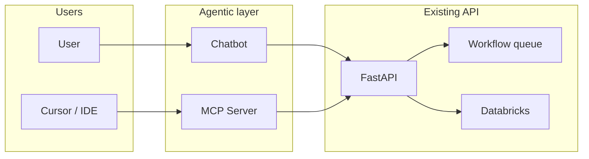
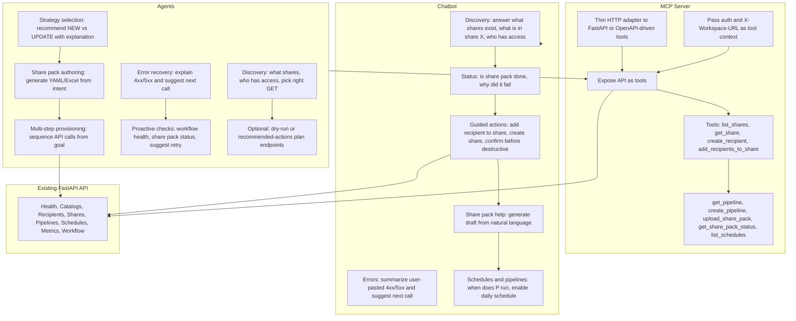

# Making DeltaShare More Agentic: MCP and Chatbot

## Current State (from repository scan)

- **API surface**: FastAPI app with routes for Health, Catalogs, Recipients, Shares, Pipelines, Schedules, Metrics, and Workflow ([main.py](api_layer/src/dbrx_api/main.py)).
- **Workflow**: Upload YAML/Excel share pack → parse → **strategy detection** (NEW vs UPDATE) → queue → provisioning (recipients, shares, pipelines, data objects) ([routes_workflow.py](api_layer/src/dbrx_api/routes/routes_workflow.py), [provisioning.py](api_layer/src/dbrx_api/workflow/orchestrator/provisioning.py)).
- **Existing "smart" behavior**: [strategy_detector.py](api_layer/src/dbrx_api/workflow/validators/strategy_detector.py) auto-detects optimal provisioning strategy by checking existing Databricks resources; validation warnings/errors are returned in [SharePackUploadResponse](api_layer/src/dbrx_api/schemas/schemas_workflow.py).
- **Auth**: Per-request `X-Workspace-URL` + Azure AD; no MCP, LLM, or chatbot code present.

---

## 1. What can be done in an "agentic" way?

**Agentic** here means: goal-oriented behavior where the system can *decide* which actions to take, in what order, and explain or correct itself using your APIs and data.

| Area | Current behavior | Agentic enhancement |
|------|------------------|----------------------|
| **Strategy selection** | Rule-based `detect_optimal_strategy` (NEW/UPDATE) | Extend with "recommendation + explanation": e.g. "Use UPDATE because shares X, Y already exist; creating new would conflict." Optionally allow natural-language override ("force new share anyway"). |
| **Share pack authoring** | User uploads YAML/Excel; parser validates | **Agent-assisted authoring**: "Generate a share pack for recipients [A,B], tables [schema.t1, schema.t2]" → agent calls list shares/recipients/pipelines, then produces valid YAML or Excel (or a draft for user to edit). |
| **Multi-step provisioning** | Single upload → queue → fixed orchestrator | **Goal-based flows**: User intent like "Ensure recipient R has access to share S and pipeline P is running" → agent sequences: get share/recipient → add recipient to share → get pipeline → create/update schedule. |
| **Error recovery and suggestions** | Validation errors and Databricks errors returned as JSON | **Explain and suggest**: On 400/404/502, agent summarizes "Share not found: foo" and suggests "List shares with prefix 'fo' to find similar names" or "Create share first via POST /shares." |
| **Proactive checks** | Manual calls to health/workflow health | **Proactive agent**: Periodically call workflow health + list share packs; if status FAILED or queue stuck, summarize and suggest "Check share pack ID X" or "Retry upload." |
| **Read-heavy discovery** | User must know which endpoint to call | **Discovery agent**: "What shares do I have?" / "Who has access to share X?" → agent picks GET /shares, GET /shares/{name}/recipients, etc., and returns a concise answer. |

**Implementation directions (no code yet):**

- Add an **intent layer**: Natural language or structured "goals" (e.g. "provision share pack for project X") mapped to sequences of existing API calls.
- Enrich **strategy_detector** (or a new "recommendation" module) to return **explanations** and **alternative actions** (e.g. "UPDATE recommended; if you want NEW, delete these recipients first").
- Add **idempotent "plan" endpoints** (e.g. "dry run" or "recommended actions") that return a list of operations the agent would perform, without executing them.
- Optionally: **automated remediation** (e.g. on provisioning failure, suggest "retry with UPDATE" or "fix schema and re-upload") as a separate agent loop that uses your APIs + workflow status.

---

## 2. Does an MCP server add value?

**Yes.** MCP (Model Context Protocol) exposes your application as **tools** that any MCP client (Cursor, CLI, another AI product) can call. Your APIs are already RESTful and well-structured; MCP would make them consumable by agents without those agents having to know HTTP or OpenAPI by heart.

**Value in this codebase:**

- **Tool set**: Each logical operation becomes a tool: e.g. `list_shares`, `get_share`, `create_recipient`, `add_recipients_to_share`, `get_pipeline`, `create_pipeline`, `upload_share_pack`, `get_share_pack_status`, `list_schedules`, etc. Auth (Azure AD + `X-Workspace-URL`) can be passed as tool context or via the MCP client's environment.
- **Single source of truth**: The real implementation stays in the FastAPI app; the MCP server is a thin adapter that calls your API (or reuses the same dependencies). No duplication of business logic.
- **Ecosystem**: Cursor (or other IDEs) and custom CLIs can "talk" to DeltaShare through the same MCP server (list shares, create recipients, check workflow status) without building a separate integration.
- **Agentic workflows**: An agent that uses MCP tools can perform the multi-step and discovery flows described in section 1 by composing these tools.

**Possible approaches:**

- **Option A – MCP server inside repo**: Add a small MCP server (e.g. Python with `mcp` package) that defines tools mapping 1:1 to your main API operations (shares, recipients, pipelines, schedules, workflow). It either (1) calls your running API over HTTP with a configured base URL and auth, or (2) imports and calls your FastAPI dependencies/routes in-process. Recommended: HTTP client to the running app so deployment stays simple (API + optional MCP server).
- **Option B – OpenAPI-driven MCP**: Use your existing [OpenAPI 3.0.3 spec](api_layer/scripts/generate_openapi.py) to generate or configure MCP tools (some frameworks support "OpenAPI as tools"). This keeps the spec as the single contract; MCP server stays a thin wrapper.
- **Option C – No in-repo MCP**: Document "how to build an MCP server for DeltaShare" (list of endpoints, auth, example tool names) so external teams or Cursor configs can implement their own. Less code in repo, still adds value.

**Recommendation:** Option A or B so that Cursor and other agents can use DeltaShare via MCP immediately; Option B reduces maintenance if you already maintain OpenAPI well.

---

## 3. What can a chatbot do for these APIs?

A **chatbot** here is a conversational interface that uses your existing APIs (and optionally MCP) to fulfill user intents. It can be a separate service (e.g. Azure Bot, or a small FastAPI app with an LLM) that calls your DeltaShare API (and/or MCP) as tools.

| User need | Chatbot behavior (using your APIs) |
|-----------|-------------------------------------|
| **Discovery** | "What shares exist?" → GET /shares. "What's in share X?" → GET /shares/{name}. "Who has access?" → GET shares + recipients. Answer in plain language. |
| **Status** | "Is my share pack done?" → GET /workflow/sharepack/{id}. "Why did it fail?" → Same endpoint + explain `ErrorMessage` / `ProvisioningStatus`. |
| **Guided actions** | "Add recipient R to share S" → Resolve names, then PUT add-recipients. "Create a share named X" → POST /shares with validated body. Confirm before destructive actions. |
| **Errors** | User pastes a 400/404/502 response → Summarize and suggest next API call (e.g. "Share not found; try listing shares or creating it."). |
| **Share pack help** | "Generate a share pack for …" → Agent uses list APIs to gather state, then returns YAML/Excel draft or a link to upload. |
| **Schedules and pipelines** | "When does pipeline P run?" → Schedules/pipelines APIs. "Enable a daily schedule for pipeline P" → POST/PATCH schedule. |

**Implementation outline:**

- **Backend**: A service that (1) accepts chat messages, (2) uses an LLM with **tool use** (or function calling) where tools = your API operations (or MCP tools), (3) executes the chosen calls with correct `X-Workspace-URL` and auth, (4) formats responses for the user.
- **Auth**: Chatbot must run with a service identity (or user-delegated token) and pass `X-Workspace-URL` (from user context or tenant config). Same security model as your API.
- **OpenAPI**: Your existing OpenAPI spec can drive tool definitions for the LLM (operation IDs, parameters, descriptions), so the chatbot stays in sync with the API.
- **Placement**: Chatbot can live in the same repo under e.g. `chatbot/` or `web/` (Phase 2), or in a separate repo that only depends on the public API contract.

---

## High-level agentic architecture

- **Chatbot** and **MCP** both talk to your **existing FastAPI** app (and thus Workflow + Databricks). No change to core business logic; agentic behavior is in the intent layer and tool use.

---

## Task breakdown: MCP, agents, and chatbot

The following diagram breaks down responsibilities and tasks for the MCP server, agentic layer (agents), and chatbot.

**Legend:**

| Layer | Role | Key tasks |
|-------|------|-----------|
| **MCP** | Expose DeltaShare as tools for any MCP client (Cursor, CLI, other agents) | Map API operations to tools; pass auth and workspace URL; single source of truth remains FastAPI. |
| **Agents** | Goal-oriented behavior using MCP or API | Strategy recommendation, share-pack generation, multi-step flows, error explanation and suggestions, proactive health/share-pack checks, discovery and dry-run plans. |
| **Chatbot** | Conversational interface for end users | Discovery (what shares, who has access), status (share pack done/failed), guided create/update with confirmation, error explanation, share-pack draft generation, schedule and pipeline questions. |

---

## Summary

| Question | Answer |
|----------|--------|
| **1. Agentic opportunities** | Strategy explanation, share-pack generation, multi-step provisioning, error explanation + suggested next calls, proactive health/share-pack checks, discovery (what shares / who has access). Implement via intent layer, richer strategy/recommendation responses, and optional "plan"/dry-run endpoints. |
| **2. MCP value** | Yes. Exposes DeltaShare as tools for Cursor and other agents; single source of truth remains the API. Prefer an in-repo MCP server (HTTP client to API) or OpenAPI-driven tools. |
| **3. Chatbot for these APIs** | Discovery, status, guided create/update (shares, recipients, schedules), error explanation, share-pack draft generation. Implement as a separate service using LLM + tool use over your API (or MCP), with auth/workspace passed per request. |

No code or config changes were made; this plan is for discussion and prioritization before implementation.
