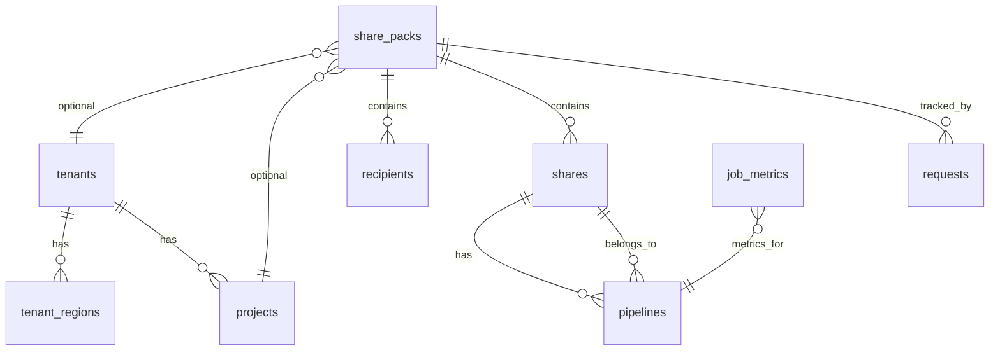

# DeltaShare Data Model

This document describes the data models used in the DeltaShare project: the **PostgreSQL workflow schema**, **API request/response schemas**, and **share pack configuration models** (YAML/Excel).

---

## 1. PostgreSQL workflow schema (Domain DB)

**Location:** [api_layer/src/dbrx_api/workflow/db/schema.sql](api_layer/src/dbrx_api/workflow/db/schema.sql)  
**Database:** PostgreSQL 14+  
**Schema:** `deltashare`  
**Pattern:** SCD Type 2 for mutable entities; append-only for event logs.

### SCD2 column pattern (mutable tables)

Every mutable table includes:

| Column | Type | Description |
|--------|------|-------------|
| `record_id` | UUID | Surrogate primary key (unique per version) |
| `{entity}_id` | UUID | Business key (stable across versions) |
| `effective_from` | TIMESTAMPTZ | When this version became active |
| `effective_to` | TIMESTAMPTZ | When superseded (`infinity` for current) |
| `is_current` | BOOLEAN | `true` for latest version |
| `is_deleted` | BOOLEAN | Soft-delete flag |
| `version` | INT | Sequential version number |
| `created_by` | VARCHAR(255) | **By whom** (who/what created this version) |
| `change_reason` | VARCHAR(500) | Why this version was created |
| `request_source` | VARCHAR(50) | **Where from:** `share_pack`, `api`, or `sync` (origin of create/update/delete) |

**Query patterns:** Current state: `WHERE is_current = true AND is_deleted = false`. Point-in-time: `WHERE effective_from <= $ts AND effective_to > $ts`.

**Tracking create/update/delete:** For every version you can see **where** the request came from (`request_source`: `share_pack`, `api`, or `sync`), **by whom** (`created_by`), and **when** (`effective_from`). On soft-delete, the new version row also gets `request_source` so you know whether the delete was triggered by share pack, API, or sync.

---

### 1.1 SCD2 mutable entities (11 tables)

| Table | Business key | Main attributes |
|-------|--------------|-----------------|
| **tenants** | `tenant_id` | `business_line_name`, `short_name`, `executive_team` (JSONB), `configurator_ad_group` (JSONB), `owner`, `contact_email` |
| **tenant_regions** | `tenant_region_id` | `tenant_id`, `region` (AM/EMEA), `workspace_url` |
| **projects** | `project_id` | `project_name`, `tenant_id`, `approver` (JSONB), `configurator` (JSONB) |
| **users** | `user_id` | `email`, `display_name`, `job_title`, `department`, `is_active`, `ad_object_id`, `source` (e.g. azure_ad) |
| **ad_groups** | `group_id` | `group_name`, `ad_object_id`, `members` (JSONB), `source` |
| **databricks_objects** | `object_id` | `workspace_url`, `full_name`, `object_type` (TABLE/VIEW/SCHEMA/CATALOG/NOTEBOOK/VOLUME), `catalog_name`, `schema_name`, `table_name`, `owner` |
| **share_packs** | `share_pack_id` | `share_pack_name`, `requested_by`, `strategy` (NEW/UPDATE/DELETE), `share_pack_status`, `provisioning_status`, `error_message`, `config` (JSONB), `file_format`, `original_filename`, `tenant_id`, `project_id` |
| **requests** | `request_id` | `project_id`, `share_pack_id`, `requested_by`, `approved_by`, `assigned_to`, `service_now_ticket`, `ado_ticket`, `request_description`, `status`, `request_type`, `approver_status`, `assigned_datetime`, `approved_datetime` |
| **recipients** | `recipient_id` | `share_pack_id`, `recipient_name`, `recipient_contact_email`, `recipient_type` (D2D/D2O), `recipient_databricks_org`, `recipient_databricks_id`, `description`, `client_ip_addresses` (JSONB), `token_expiry_days`, `token_rotation`, `request_source` |
| **shares** | `share_id` | `share_pack_id`, `share_name`, `databricks_share_id`, `share_assets` (JSONB), `recipients` (JSONB), `ext_catalog_name`, `ext_schema_name`, `prefix_assetname`, `share_tags` (JSONB), `request_source` |
| **pipelines** | `pipeline_id` | `share_pack_id`, `share_id`, `pipeline_name`, `databricks_pipeline_id`, `databricks_job_id`, `name_prefix`, `asset_name`, `source_table`, `target_table`, `scd_type`, `key_columns`, `schedule_type`, `cron_expression`, `cron_timezone`, `notification_list` (JSONB), `tags` (JSONB), `serverless`, `request_source` |

---

### 1.2 Append-only tables (5 tables)

| Table | Purpose | Key columns |
|-------|---------|-------------|
| **job_metrics** | Pipeline run metrics | `pipeline_id`, `databricks_pipeline_id`, `pipeline_name`, `start_time`, `end_time`, `duration_seconds`, `status`, `run_id`, `error_message`, `collected_at` |
| **project_costs** | Cost tracking | `project_id`, `tenant_id`, `period_start`, `period_end`, `period_type`, `databricks_cost`, `azure_cost`, `network_cost`, `io_cost`, `total_cost` (generated), `currency`, `collected_at` |
| **sync_jobs** | Sync run history | `sync_type` (AD_USERS, AD_GROUPS, DATABRICKS_OBJECTS, JOB_METRICS, PROJECT_COSTS), `workspace_url`, `status`, `started_at`, `completed_at`, `records_processed`/`created`/`updated`/`failed`, `error_message`, `details` (JSONB) |
| **notifications** | Outbound notifications | `notification_type`, `recipient_email`, `subject`, `body`, `related_entity_type`, `related_entity_id`, `status`, `sent_at`, `error_message`, `created_at` |
| **audit_trail** | Action audit | `entity_type`, `entity_id`, `action` (CREATED/UPDATED/DELETED/STATUS_CHANGED/PROVISIONED/RECREATED), `performed_by`, `old_values` (JSONB), `new_values` (JSONB), `timestamp` |

---

### 1.3 Key relationships

- **tenant_regions** → **tenants** (`tenant_id`)
- **projects** → **tenants** (`tenant_id`)
- **share_packs** → **tenants** (`tenant_id`), **projects** (`project_id`) (optional)
- **requests** → **projects** (`project_id`), **share_packs** (`share_pack_id`)
- **recipients** → **share_packs** (`share_pack_id`)
- **shares** → **share_packs** (`share_pack_id`)
- **pipelines** → **share_packs** (`share_pack_id`), **shares** (`share_id`)
- **job_metrics** → **pipelines** (logical link via `pipeline_id` / `databricks_pipeline_id`)

---

## 2. API request/response schemas (REST)

**Location:** [api_layer/src/dbrx_api/schemas/schemas.py](api_layer/src/dbrx_api/schemas/schemas.py)

These Pydantic models validate REST API payloads. Databricks SDK types (e.g. `ShareInfo`, `RecipientInfo`) are used where the API returns SDK objects directly.

### 2.1 Query / list params

| Model | Use |
|-------|-----|
| `GetSharesQueryParams` | List shares: `prefix`, `page_size` |
| `GetRecipientsQueryParams` | List recipients: `prefix`, `page_size` |
| `GetPipelinesQueryParams` | List pipelines: `search_string`, `page_size` |

### 2.2 Catalog

| Model | Use |
|-------|-----|
| `CreateCatalogRequest` | POST create catalog: `comment`, `external_location` |

### 2.3 Shares

| Model | Use |
|-------|-----|
| `AddDataObjectsRequest` | Add data objects: `tables`, `views`, `schemas` (lists of fully qualified names) |
| Responses | Share endpoints often return `ShareInfo` (Databricks SDK) or wrapper with `Message` + `Share` |

### 2.4 Recipients

| Model | Use |
|-------|-----|
| `GetRecipientsResponse` | List recipients: `Message`, `Recipient` (list of `RecipientInfo`) |
| `RecipientMetadata` | Metadata: `name`, `auth_type`, `created_at` |
| `DeleteRecipientResponse` | Delete: `message`, `status_code` |

### 2.5 Pipelines (DLT)

| Model | Use |
|-------|-----|
| `PipelineConfigurationModel` | Create pipeline config: `source_table`, `keys`, `target_table`, `scd_type`, fixed `sequence_by`/`delete_expr` |
| `CreatePipelineRequest` | Create pipeline: `target_catalog_name`, `target_schema_name`, `configuration`, `notifications_list`, `tags`, `serverless` |
| `UpdatePipelineConfigurationModel` | Update config: `keys`, `target_table` (partial) |
| `UpdatePipelineLibrariesModel` | Update libraries: `library_path`, `root_path` |
| `UpdatePipelineNotificationsModel` | Update notifications: `notifications_list` |
| `UpdatePipelineTagsModel` | Update tags: `tags` dict |
| `UpdatePipelineTagsRemoveModel` | Remove tags: `tag_keys` |
| `UpdatePipelineContinuousModel` | Continuous mode: `continuous` (bool) |

### 2.6 Workflow API responses

**Location:** [api_layer/src/dbrx_api/schemas/schemas_workflow.py](api_layer/src/dbrx_api/schemas/schemas_workflow.py)

| Model | Use |
|-------|-----|
| `SharePackUploadResponse` | After upload: `Message`, `SharePackId`, `SharePackName`, `Status`, `ValidationErrors`, `ValidationWarnings` |
| `SharePackStatusResponse` | Share pack status: `SharePackId`, `SharePackName`, `Status`, `Strategy`, `ProvisioningStatus`, `ErrorMessage`, `RequestedBy`, `CreatedAt`, `LastUpdated` |
| `SharePackHistoryItem` | One history row: `Version`, `Status`, `EffectiveFrom`, `EffectiveTo`, `ChangedBy`, `ChangeReason` |
| `SharePackHistoryResponse` | History: `Message`, `SharePackId`, `SharePackName`, `History` |
| `SharePackListResponse` | List: `Message`, `Count`, `SharePacks` |
| `TenantResponse` | Tenant: `TenantId`, `BusinessLineName`, `ShortName`, `ExecutiveTeam`, `ConfiguratorAdGroup`, `Owner`, `ContactEmail` |
| `TenantListResponse` | List tenants: `Message`, `Count`, `Tenants` |
| `WorkflowHealthResponse` | Workflow health: `Message`, `DatabaseConnected`, `QueueConnected`, `TablesCount` |

---

## 3. Share pack configuration models (YAML/Excel)

**Location:** [api_layer/src/dbrx_api/workflow/models/share_pack.py](api_layer/src/dbrx_api/workflow/models/share_pack.py)

These Pydantic models represent the **canonical share pack** structure parsed from YAML or Excel. They are used by [parser_factory](api_layer/src/dbrx_api/workflow/parsers/parser_factory.py), [yaml_parser](api_layer/src/dbrx_api/workflow/parsers/yaml_parser.py), and [excel_parser](api_layer/src/dbrx_api/workflow/parsers/excel_parser.py).

### 3.1 Top-level

| Model | Description |
|-------|-------------|
| **SharePackConfig** | Root: `metadata`, `recipient` (list), `share` (list). Validates unique recipient/share names and at least one of each. |

### 3.2 Metadata

| Model | Description |
|-------|-------------|
| **SharePackMetadata** | `version`, `last_updated`, `owner`, `contact_email`, `business_line`, `delta_share_region` (AM/EMEA), `configurator`, `approver`, `executive_team`, `approver_status`, `requestor`, `strategy` (NEW/UPDATE/DELETE), `workspace_url`, `servicenow_ticket`. |

### 3.3 Recipients

| Model | Description |
|-------|-------------|
| **RecipientConfig** | `name`, `type` (D2D/D2O), `recipient` (email), `description`/`comment`, `recipient_databricks_org` (D2D), `recipient_ips` / `recipient_ips_to_add` / `recipient_ips_to_remove` (D2O), `token_expiry`, `token_rotation`. |

### 3.4 Shares and pipelines

| Model | Description |
|-------|-------------|
| **ShareConfig** | `name`, `description`/`comment`, `share_assets` (list), `recipients` (list of names), `delta_share` (DeltaShareConfig), `pipelines` (list of PipelineConfig). |
| **DeltaShareConfig** | Target workspace: `ext_catalog_name`, `ext_schema_name`, `tags`. |
| **CronSchedule** | `cron`, `timezone` (default UTC). |
| **PipelineConfig** | `name_prefix`, `source_asset`, `target_asset`, `description`/`comment`, `schedule` (CronSchedule / `"continuous"` / dict), `notification`, `tags`, `serverless`, `scd_type`, `key_columns`, `ext_catalog_name`/`ext_schema_name` overrides. |

### 3.5 Workflow entity models (DB view)

**Location:** [api_layer/src/dbrx_api/workflow/models/](api_layer/src/dbrx_api/workflow/models/)

Pydantic models that mirror the **current row** of SCD2 tables (for in-app use, not the raw DB):

| Model | Table | Notes |
|-------|-------|--------|
| **Tenant** | tenants | Includes SCD2 fields (`effective_from`, `effective_to`, `is_current`, etc.). |
| **TenantRegion** | tenant_regions | `tenant_id`, `region`, `workspace_url`. |
| **Project** | projects | `project_name`, `tenant_id`, `approver`, `configurator`. |
| **Request** | requests | Approval workflow. |
| **Recipient** | recipients | `recipient_name`, `recipient_type`, `share_pack_id`, Databricks IDs, IP list, token settings. |
| **Share** | shares | `share_name`, `share_pack_id`, `share_assets`, `recipients`, delta share target config. |
| **Pipeline** | pipelines | Pipeline and job IDs, asset names, source/target tables, schedule, SCD type, keys. |
| **User** | users | From sync_entities. |
| **ADGroup** | ad_groups | From sync_entities. |
| **DatabricksObject** | databricks_objects | From sync_entities. |
| **JobMetrics** | job_metrics | Append-only. |
| **ProjectCost** | project_costs | Append-only. |
| **SyncJob** | sync_jobs | Append-only. |
| **Notification** | notifications | Append-only. |

---

## 4. Summary diagram

- **Config flow:** YAML/Excel → `SharePackConfig` (metadata + recipient + share) → validated → stored as `share_packs.config` (JSONB) and normalized into `recipients`, `shares`, `pipelines` (and related) during provisioning.
- **API flow:** REST request → Pydantic schemas in `schemas.py` / `schemas_workflow.py` → routes → Databricks SDK or workflow DB (repositories in `workflow/db/`).

---

## 5. Where records in recipients, shares, pipelines come from

| Table        | Share pack (YAML/Excel) provisioning | Direct API/APIM (REST) create/update |
|-------------|---------------------------------------|--------------------------------------|
| **recipients** | Yes — logged via `RecipientRepository.create_from_config` / `upsert_from_config` in `recipient_flow.py` during NEW/UPDATE. | No — create/update recipient APIs only call Databricks SDK; they do **not** insert into `deltashare.recipients`. Delete recipient API does soft-delete in DB when the recipient name exists in the table. |
| **shares**     | Yes — logged via `ShareRepository.create_from_config` / `upsert_from_config` in `share_flow.py` during NEW/UPDATE. | No — create/update share APIs only call Databricks SDK; they do **not** insert into `deltashare.shares`. |
| **pipelines**  | Yes — logged via `PipelineRepository.create_from_config` / `upsert_from_config` in `pipeline_flow.py` during NEW/UPDATE. Includes schedule fields (`schedule_type`, `cron_expression`, `cron_timezone`, `databricks_job_id`). | No — create/update pipeline APIs only call Databricks SDK; they do **not** insert into `deltashare.pipelines`. |
| **Schedules**   | No separate table. Schedule data is stored on **pipelines** (`schedule_type`, `cron_expression`, `cron_timezone`, `databricks_job_id`). So any pipeline row logged from share pack provisioning includes its schedule. | Same — no separate schedule table; schedule is part of pipeline. API-created pipelines are not logged to the DB. |

**Summary:** Only resources created or updated through **share pack templates** (upload YAML/Excel → workflow queue → orchestrator) are written to the workflow data model tables `recipients`, `shares`, and `pipelines`. Resources created or updated via **direct REST APIs** (or APIM in front of them) exist only in Databricks unless they were previously provisioned via a share pack (in which case later updates via API still do not update the DB).
